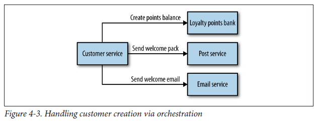

## Orchestration

With orchestration style, you rely on a central brain to guide and drive the process through a series of request/response calls i.e. one service controller handles all communications in a tightly coupled, synchronous manner.

The orchestrator is responsible for invoking and combining the services. The relationship between all participating services are described by a single endpoint i.e. composite service.

### Benefits

- Synchronization of goals, collective motivation, conflict management and group synergy

### Drawbacks

- Orchestrator can become too much of a central governing authority
-
