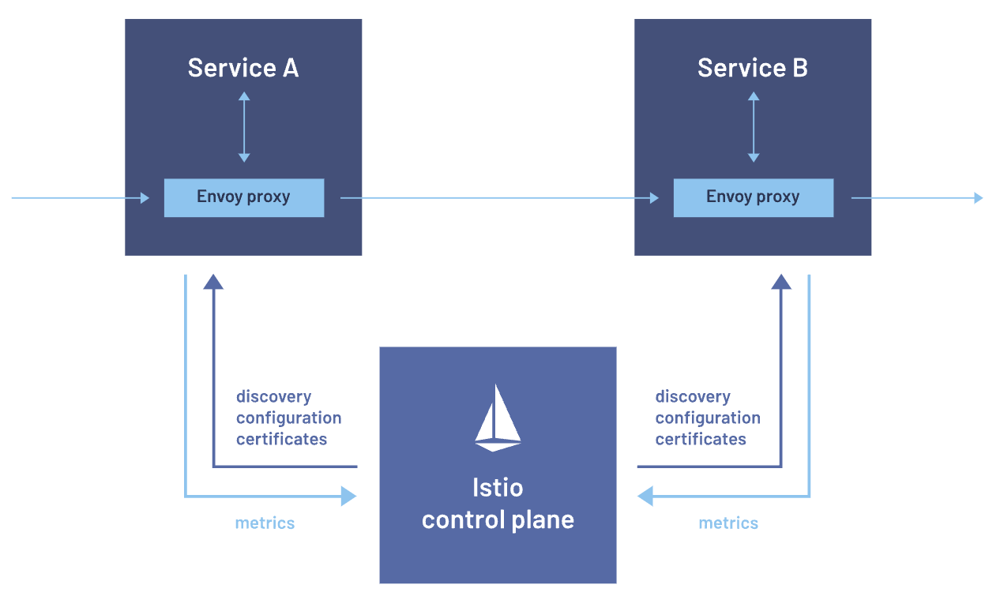
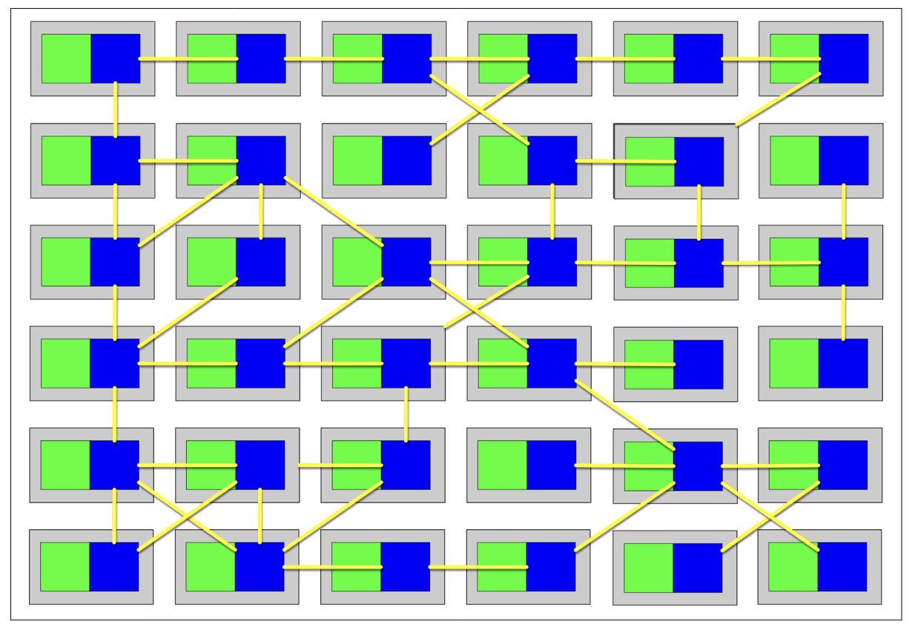

## Why need service mesh?

The modularity and flexibility of microservices brings complexity and challenges as applications grow to include many services that need to communicate with each other. This becomes even more challenging when the application receives heavy traffic because a single microservice might become overwhelmed if it receives too many requests too quickly.

In general, your organization can benefit from a service mesh if you have large-scale applications composed of many microservices. As application traffic grows, requests between these services can increase exponentially, requiring sophisticated routing capabilities to optimize the flow of data between the services and ensure the application continues to perform at a high level.

## Service mesh

A service mesh is a dedicated infrastructure layer built into an application that controls service-to-service communication in a microservices architecture. It controls the delivery of service requests to other services, performs load balancing, encrypts data, and discovers other services. This functionality is added at the **platform layer rather than the application layer**.

Although you can code the logic that governs communication directly into the microservices, a service mesh abstracts that logic into a parallel layer of infrastructure using a **proxy called a sidecar**, which runs alongside each service. The proxies comprise the service mesh’s data plane, and are controlled as a whole by its control plane.

The service mesh acts as a proxy that intercepts all network communication between microservices in the cluster, and can be used to implement networking features i.e. encryption, load-balancing, retries, logging, circuit breaker, monitoring, etc.

Currently, the **service mesh concept applies mainly to container orchestrators** e.g. Kubernetes, rather than serverless architectures. Service mesh is also an example of the Ambassador pattern i.e. a helper service that sends network requests on behalf of the application.

Sidecar proxies make up a service mesh’s data plane, which manages the exchange of data between services. Management processes make up the control plane, which coordinates the proxies’ behavior. The control plane also provides an API so operators can easily manage traffic control, network resiliency, security and authentication, and custom telemetry data for each service.

## Sidecar

The Sidecar pattern allows governance groups like enterprise architects a reasonable restraint over too many polyglot environments. One of the advantages of microservices is a reliance on integration rather than a common platform, allowing teams to choose the correct level of complexity and capabilities on a service-by-service basis. However, as the number of platforms proliferates, unified governance becomes more difficult. Therefore, teams often use the consistency of the service mesh as a driver to support infrastructure and other cross-cutting concerns across multiple heterogeneous platforms.

Without a service mesh, if enterprise architects want to unify around a common monitoring solution, then teams must build a sidecar per platform that supports that solution.

## How does a service mesh work?

### Data plane

The data plane is a network proxy replicated alongside each microservice (known as a sidecar), which manages all inbound and outbound network traffic on behalf of the microservice. As part of this, it may perform service discovery, load balancing, security and reliability functions. The service and sidecar should be deployed on the same host and if your deployment is containerized in the same pod.

### Control plane

Proxies need to be configured. This is done through the control plane, which consists of several services that provide administrative functionality over the service mesh and provides an interface to configure the behavior of the data plane and for the proxies to coordinate their actions.

## Benefits

### Centralized traffic management

A service mesh allows for fine-grained control over communication between services, including advanced routing capabilities, retries, and failovers. This can be crucial in ensuring high availability and resilience.

### Security at scale

Security is paramount in microservices architecture, and service mesh addresses this by providing a uniform layer for implementing security measures like encryption, authentication, and authorization. It ensures that communication between services remains secure without burdening individual services with security concerns.

### Resilience and fault tolerance

Service mesh introduces capabilities for implementing circuit breaking, retries, and timeouts, promoting resilience in the face of failures. It enables applications to gracefully handle faults, preventing cascading failures and ensuring optimal user experiences.

### Enhanced observability

Service mesh provides unparalleled visibility into the interactions between microservices. With features like distributed tracing and monitoring, organizations can gain insights into the performance and behavior of their applications, facilitating efficient troubleshooting and optimization.

## Drawbacks

### Increased complexity

Introducing service mesh can add a layer of complexity to the architecture. Organizations must invest time and effort in understanding, implementing, and maintaining the mesh, potentially impacting the agility of development teams.

### Performance overhead

While service mesh provides invaluable features, it comes with a performance cost. The additional layer of proxies handling communication can introduce latency, impacting the application’s overall performance. Organizations must carefully balance the benefits against this overhead.

### Steep learning curve

Adopting service mesh requires a learning curve for development and operations teams. Understanding the intricacies of the mesh, configuring policies, and troubleshooting issues demand expertise, necessitating training and upskilling initiatives.

### Vendor lock-in

Some service meshes are tightly coupled with specific platforms or technologies. Choosing an open source, vendor-neutral solution can mitigate this risk.

## Vendors

Linkerd, Conduit, Istio, and Envoy.
