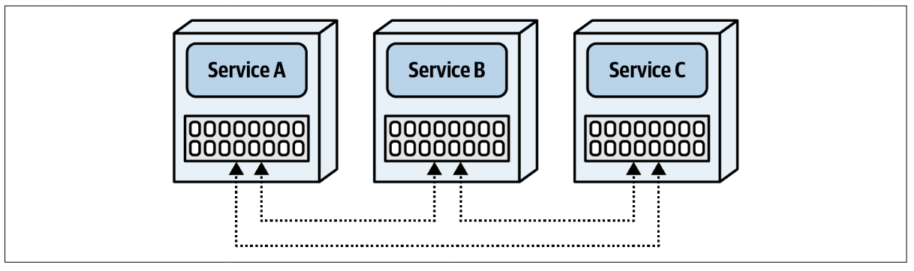

## Distributed data access

In most monolithic systems, developers don't give a second thought to reading database tables. However, when data is broken into separate databases or schemas owned by distinct services, data access for read operations starts to become hard.

## Inter-service communication pattern

This is the most common pattern for accessing data in a distributed system.

<table>
<tr>
<th>Advantages</th>
<th>Disadvantages</th>
</tr>
<tr>
<td>Simplicity</td>
<td>Network, data and security latency</td>
</tr>
<tr>
<td>No data volume issues</td>
<td>Scalability and throughput issues</td>
</tr>
<tr>
<td></td>
<td>No fault tolerance</td>
</tr>
<tr>
<td></td>
<td>Requires contracts between services (static service coupling)</td>
</tr>
</table>

## Column schema replication pattern

With this pattern, columns are replicated across tables, therefore replicating the data and making it available to other bounded contexts.

Data synchronization and consistency are the two biggest issues associated with this pattern. This is usually done through asynchronous communications using queues, topics, or event streaming.

Another challenge is that it is sometimes difficult to govern data ownership. As the data is replicated, those services can update the data, even though they don't officially own the data.

<table>
<tr>
<th>Advantages</th>
<th>Disadvantages</th>
</tr>

<tr>
<td>Good data access performance</td>
<td>Data consistency issues</td>
</tr>

<tr>
<td>No scalability and throughput issues</td>
<td>Data ownership issues</td>
</tr>

<tr>
<td>No fault-tolerance issues</td>
<td>Data synchronization is required</td>
</tr>

<tr>
<td>No service dependencies</td>
<td></td>
</tr>

</table>

## Replicated caching pattern

Caching can be an effective tool for distributed data access and sharing. By storing data within an in-memory cache, the data can be made available to other services without having to ask for it.

A replicated cache differs from other caching models in that data is held in-memory within each service and is continuously synchronized so that all services have the same exact data at all times.

Having a distributed cache model whereby data is held externally within a caching server and not in each service **is not effective** for the following:

- No benefit to fault-tolerance issues (dependency has merely shifted to the caching server)
- Breaks bounded context as cache data is centralized and shared
- Network and latency issues

With replicated caching, **each service has its own in-memory data that is kept in sync between the services**, allowing the same data to be shared across multiple services. Each cache instance communicates with another so that when an update is made to a cache, that update is immediately asynchronously propagated to other services using the same cache.

## Data domain pattern
