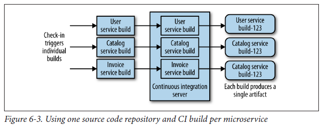

### Continuous Integration

Core goal is to keep everyone in sync with each other, which we achieve by making sure that newly checked-in code properly integrates with existing code. To do this, a CI server detects that the code has been committed, checks it out, and carries out some verification such as making sure the code compiles and that tests pass.

As part of this process, we often build artifacts that are used for further validation, such as deploying a running service to run tests against it.

### Mapping Continuous Integration to Microservices

It is important to ensure that we can make a change to a single service and deploy it independently of the rest.

Instead of having a monolith build that has significant downsides such as requiring all services to be deployed just for a single change, a better approach would be to have a single CI build per microservice, to allow us to quickly make and validate a change prior to deployment into production.

Each microservice has its own source repository, mapped to its own CI build. When making a change, you run only the build and tests you need to. Nonetheless, making changes across repositories can be more difficult, but it is easier to resolve.

