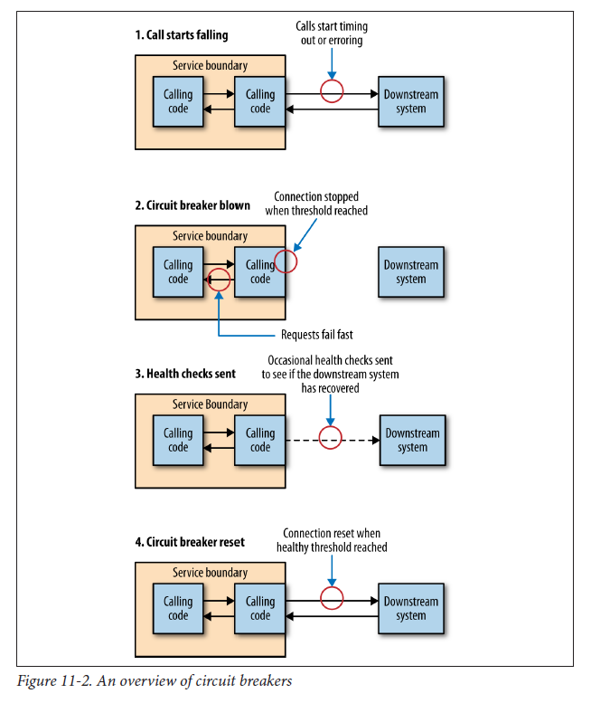

## Building resilience

Though it is good to put processes and controls in place to stop failures from occurring, we also need to put thought into making the services easier to recover from failure (**resilience**). To understand which techniques make most sense, need to have knowledge on how much failure you can tolerate, or how fast your system needs to be i.e. response time/latency, availability, and durability of data (how much data loss is acceptable).

## Architectural safety measures

Should consider standardizing in your system to ensure that one bad citizen doesn't bring the whole world crashing down.

### Simulating failures

Some organizations like Netflix and Google write programs that simulate/incite failures such as Chaos Monkey, which during certain hours of the day will turn off random machines. By causing failures to happen and building for it, you can ensure that the systems can scale reliably.

### Timeouts

In a downstream system, this is important to get it right. Waiting for a call that has failed for too long can slow the entire system.

### Circuit breakers

With a circuit breaker, after a certain number of requests to a downstream service has failed (i.e. 500X status or timeout for HTTP), the circuit breaker is blown. All further requests fail when the circuit breaker is in blown state.

While the circuit breaker is blown, you can either queue up the requests and retry later, or simply fail fast to avoid propagating the error up the call chain (for asynchronous operations).

### Bulkheads

Bulkheads are used to isolate part of a system that is failing. One example would be implementing different connection pools for each downstream connection. When one connection pool gets exhausted, the other connections are not impacted.

Separation of concerns (SoC) can also be a way to implement bulkheads. By tearing apart functionality into separate microservices, we can reduce the change of an outage in one area affecting another.

Load shedding (rejecting requests in certain conditions) can also be implemented and sometimes be the best method for stopping an important system from being overwhelmed and becoming a bottleneck.

Examples of libraries include Hystrix, Polly, and circuit_breaker mixin.
