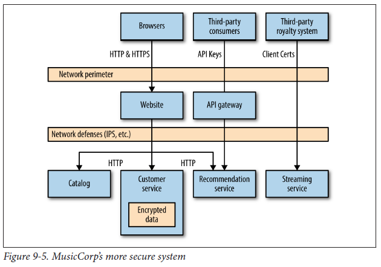

## Service-to-service authentication and authorization

### HTTPS

Client gains strong guarantees that the server it is talking to is who the client thinks it is. Also gives us additional protection against people eavesdropping on the traffic between client and server or messing with the payload.

Downside is that server needs to manage its own SSL certificates which can be problematic when it is managing multiple machines. Also, traffic sent via SSL cannot be cached via reverse proxies. Hence, if you want to cache traffic, need to be done inside the server or client, or have cache sit behind load balancer.

### SAML/OIDC

If you are already using SAML or OIDC as your authentication and authorization scheme, can just use that for service-to-service interactions too. Advantage is that you are making use of existing infrastructure and get to centralize all your service access controls in a central directory server.

This does mean you will need an account for your clients, also known as a service account. Consider each microservice having its own set of credentials, as this makes revoking/changing access easier if credentials become compromised, as you will only need to revoke the set of credentials that has been affected.

### Client certificates

Another approach to confirm the identity of a client is to make use of capabilities in Transport Layer Security (TLS), the successor to SSL, in the form of client certificates. Each client has an X.509 certificate installed that is used to establish a link between client and server.

However, the operational challenges in certificate management are more onerous than with just using server-side certificates. You can expect to spend a lot of time trying to diagnose why a service won't accept what you believe to be completely valid certificate.

### HMAC over HTTP

Basic authentication over HTTP is not sensible due to credentials being sent over the wire, and HTTPS requires managing of certificates and overheads of HTTPS traffic can place additional strain on servers. An alternative approach is to use **Hash-Based Messaging Code (HMAC)** to sign the request that is used extensively by Amazon's S3 APIs for AWS.

With HMAC, the body request along with a private key is hashed and sent along with the request. The server then uses its own copy of the private key and request body to re-create the hash. If a man in the middle messes with the request, the hash won't match and the server will know the request has been tampered with. Private key is also never sent in the request and hence, cannot be compromised.

Nonetheless, this is a pattern and not a standard, and there are divergent ways of implementing it. It is important to use a sensible hashing function such as SHA-256 or JWT.

### API keys

All public APIs from services like Twitter, Google, and AWS make use of API keys. API keys allow a service to identify who is making a call, and place limits on what they can do.

Exact mechanics depend on the technology you use. Some systems use single API key that is shared across microservices, while others use HMAC. A more common approach is to use a public and private key pair.

## The deputy problem

Having a principal authenticate with a given microservice is simple, but it is quite common if it needs to make additional calls to other services to complete an operation. In the context of service-to-service communication, there may arise a situation whereby a malicious party tricks a deputy service into making calls to a downstream service on his behalf that he shouldn't be able to. This type of vulnerability is known as the **confused deputy problem**.

You could make use of certificates, API keys, etc., but the extend to which we have to go in validating trust between deputy services is tough. Depending on the sensitivity, you might have to choose between adopting a stance of implicit trust (accepting any calls that come from within your perimeter) and verifying the identity of the caller.

