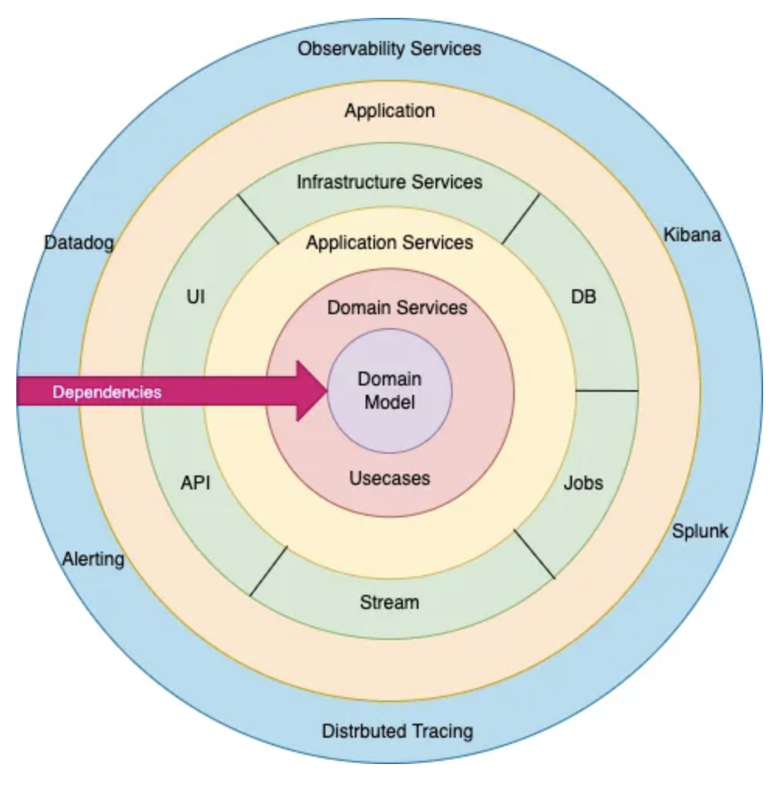

## Onion architecture

Onion Architecture is a software architectural pattern introduced by Jeffrey Palermo that promotes a modular and loosely coupled design, focusing on separation of concerns and maintainability. It helps developers create applications that are more flexible, testable, and easier to evolve over time.

Onion architecture implements the concept of **Domain-Driven Design** and dramatically increases code quality, reduces complexity and enables evolutionary enterprise systems.

It is based on the **inversion of control** principle. The architecture does not focus on underlying technology or frameworks but the actual domain models.

### Why Onion architecture?

Domain entities are the core and centre part. Onion architecture is built on a domain model in which **layers are connected through interfaces**. The idea is to **keep external dependencies as far outward as possible** where domain entities and business rules form the core part of the architecture.

### Benefits

- Provides flexible, sustainable and portable architecture
- Layers are not tightly coupled and have separation of concerns
- Provides better maintainability as all the code depends on deeper layers or the centre
- Improves overall code testability as unit tests can be created for separate layers without impacting other module
- Frameworks/technologies can be easily changed without impacting the core domain. e.g. RabbitMQ can be replaced by ActiveMQ, SQL can be replaced by MongoDB

## Concepts

### Layers

- Domain: Contains the core business logic, entities, and business rules of the application
- Application: Implements use cases and coordinates the flow of data between the domain and infrastructure layers
- Infrastructure: Handles external concerns such as databases, file systems, or external services
- Presentation: Handles user interfaces and presentation-related logic

### Dependency

Dependencies flow inward, with **inner layers having no knowledge of outer layers**, and the outer layers depending on inner layers. This ensures that high-level modules do not depend on low-level modules directly. Instead, both depend on abstractions, enabling interchangeable implementations and reducing coupling.

Whenever data crosses layers/boundaries, it should be in a form that is convenient for that layer.

### Data encapsulation

Each layer encapsulates or hides internal implementation details and exposes an interface to the outer layer. All layers also need to provide information that is conveniently consumed by inner layers. The goal is to **minimize coupling between layers and maximize coupling within a vertical slice across layers**.

We define abstract interfaces at deeper layers and provide their **concrete implementation at the outermost layer**. This ensures we focus on the domain model without worrying too much about implementation details. We can also use dependency injection frameworks, like Spring, to connect interfaces with implementation at runtime.

### Separation of concerns

Each layer has a distinct responsibility, ensuring that business logic remains decoupled from infrastructure or presentation concerns. This separation improves code maintainability and facilitates testing.
