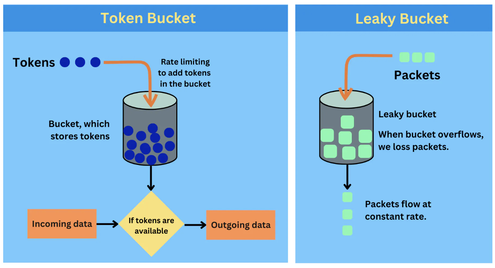

## Token vs leaky bucket

Token Bucket and Leaky Bucket are two algorithms used for network traffic shaping and rate limiting. They help manage the rate of traffic flow in a network, but they do so in slightly different ways.

## Token bucket

The token bucket algorithm is based on tokens being added to a bucket at a fixed rate. Each token represents permission to send a certain amount of data. When a packet (data) needs to be sent, it can only be transmitted if there is a token available, which is then removed from the bucket.

Take a video streaming service for instance. The service allows data bursts for fast initial streaming (buffering) as long as tokens are available in the bucket. Once the tokens are used up, the streaming rate is limited to the rate of token replenishment.

### Characteristics

- Burst allowance: Can handle bursty traffic because the bucket can store tokens, allowing for temporary bursts of data as long as there are tokens in the bucket
- Flexibility: The rate of token addition and the size of the bucket can be adjusted to control the data rate
- Monitoring: Requires monitoring the number of available tokens, which might add complexity

## Leaky bucket

In the leaky bucket algorithm, packets are added to a queue (bucket), and they are released at a steady, constant rate. If the bucket (buffer) is full, incoming packets are discarded or queued for later transmission.

Imagine an ISP limiting internet speed. The ISP uses a leaky bucket to smooth out the internet traffic. Regardless of how bursty the incoming traffic is, the data flow to the user is at a consistent, predetermined rate. If the data comes in too fast and the bucket fills up, excess packets are dropped.

### Characteristics

- Smooth traffic: Ensures a steady, uniform output rate regardless of the input burstiness
- Overflow: Can result in packet loss if the bucket overflows
