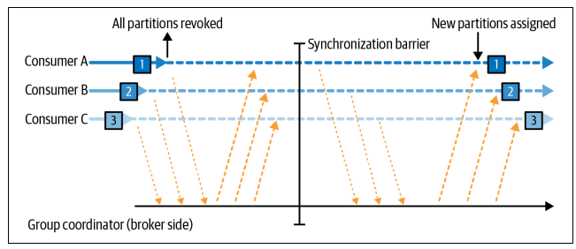
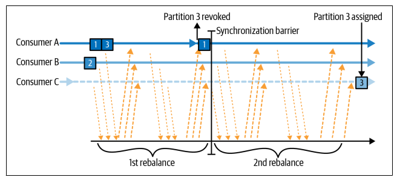

## Consumer

Applications that need to read data from Kafka use a KafkaConsumer to subscribe to Kafka topics and receive messages from these topics.

## Consumer groups

Similarly to multiple producers, consumers can be scaled up to read from the same topic within a consumer group, splitting the data among them. When multiple consumers are subscribed to a topic, each consumer in the group will receive messages from a different subset of the partitions in the topic. However, **there is no point adding more consumers than you have partitions in a topic as some consumers will be idle**.

In addition to adding consumers to scale a single application, it is very common to have multiple applications that need to read data from the same topic. This is done by creating another consumer group for the application.

In summary, Kafka message/record is processed by only **one consumer process per consumer group**. Two consumers within the same group cannot consume the same message from a partition i.e. they will each receive different messages. However, two consumers in different groups can consume the same message.

## Consumer groups and partition rebalance

Consumers in a consumer group share ownership of the partitions in the topics they subscribed to. When we add a new consumer to the group, it starts consuming messages from partitions previously consumed by another consumer. The same thing happens when a consumer shuts down or crashes.

Consumers maintain membership by sending heartbeats to the Kafka broker. If it stops sending heartbeats long enough, the group coordinator will consider it dead and trigger a rebalance.

Rebalances are important as they provide the group with high availability and scalability. There are two types of rebalances, depending on the partition assignment strategy that the group uses.

### Eager rebalance

During an eager rebalance, all consumers stop consuming, give up their ownership of all partitions, rejoin the consumer group, and get a brand-new partition assignment. This is essentially a short window of unavailability of the entire group.

### Cooperative rebalance

Cooperative rebalances involve reassigning a small subset of the partitions from one consumer to another, and allowing consumers to continue processing records from all the partitions that are not reassigned. This rebalancing is achieved in two or more phases:

- the consumer group leader informs all the consumers that they will lose ownership of a subset of their partitions
- Consumers stop consuming from these partitions and ownership is given up
- Leader assigns orphaned partitions to their new owners

This incremental approach may take several iterations until a stable partition assignment is achieved, but it avoids short term unavailability. This is important in large groups when rebalances take a significant amount of time.

### Static group

By default, identity of a consumer as a member of a group is transient. However, by configuring a unique group.instance.id, it makes the consumer a static member of the group. When the consumer shuts down, it does not automatically leave the group until its session times out (session.timeout.ms). When it rejoins, it is recognized with its static identity and is reassigned the same partitions it previously held without triggering a rebalance.

For a certain duration, no consumer will consume messages from assigned partitions to the static consumer, and it will lag behind once it rejoins. You should be confident that the consumer will be able to catch up after restart.

## Thread safety

You can't have multiple consumers that belong to the same group in one thread, and you can't have multiple threads safely use the same consumer. **One consumer per thread is the rule**. To run multiple consumers in the same group in one application, you will need to run each in its own thread.
