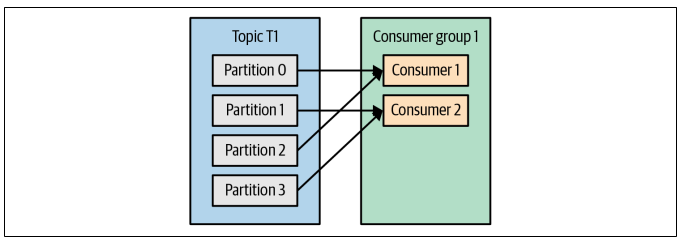
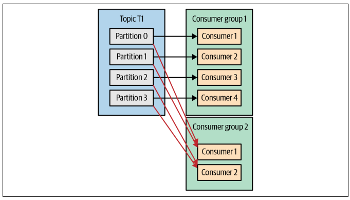

## Consumer

Applications that need to read data from Kafka use a KafkaConsumer to subscribe to Kafka topics and receive messages from these topics.

## Consumer Groups

Similarly to multiple producers, consumers can be scaled up to read from the same topic within a consumer group, splitting the data among them. When multiple consumers are subscribed to a topic, each consumer in the group will receive messages from a different subset of the partitions in the topic. However, there is no point adding more consumers than you have partitions in a topic as some consumers will be idle.

In addition to adding consumers to scale a single application, it is very common to have multiple applications that need to read data from the same topic. This is done by creating another consumer group for the application.

