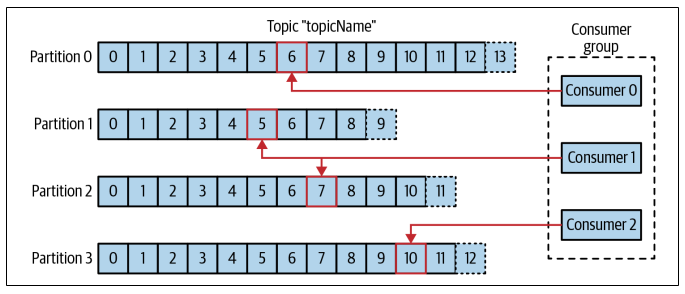

## Messages

The unit of data within Kafka. The data contained within it does not have a specific format or meaning to Kafka, and may have optional pieces of metadata which are referred to as keys.

## Batches

For efficiency, messages are written in batches. A batch is a collection of messages, all of which are being produced to the same topic and partition. Batches are typically **compressed** to provide more efficient transmission of data.

Individual round trips for each message would result in excessive overhead, but this leads to a **trade-off between latency and throughput**. The larger the batches, the longer it takes an individual message to propagate.

## Topics

Messages are categorized into topics. The closest analogies for a topic are a database table or a folder in a filesystem. Topics are additionally broken down into a number of partitions.

## Partitions

A partition is a single log. Messages are written to it in an append-only fashion and are read in order from beginning to end. Partitions are the way that Kafka provides redundancy and scalability.

Each partition can be hosted on a different server, which means that a single topic can be scaled horizontally across multiple servers to provide performance. Partitions can also be replicated, such that different servers will store a copy of the same partition in case one server fails.

## Streams

A stream is considered to be a single topic of data, regardless of the number of partitions.

## Producers

Producers create new messages. A message will be produced to a specific topic. By default, the producer will balance messages over all partitions of a topic evenly. In some cases, the producer will direct messages to specific partitions. This is typically done using the message key and a partitioner will generate a hash of the key and map it to a specific partition.

## Consumers

Consumers read messages. The consumer subscribes to one or more topics and reads the messages in order in which they were produced to each partition. The consumer keeps track of the messages consumed by keeping track of the **offset**.

The offset is an integer value that continually increases, and is a metadata that Kafka adds to each message as it is produced. The message in a given partition has a unique offset, and the following message has a greater offset.

Consumers work as part of a consumer group to consume a topic. The group ensures that each partition is only consumed by one member. The mapping of a consumer to a partition is often called **ownership** of the partition by the consumer.

## Brokers and Clusters

A single Kafka server is called a broker that can handle thousands of partitions and millions of messages per second. The broker performs the following:

- Receives messages from producers
- Assigns offsets to messages
- Writes the message to storage on disk
- Responds to fetch requests for partitions and responding with messages that have been published

Kafka brokers are designed to operate as part of a cluster. Within a cluster, one broker will function as the cluster controller (elected automatically from the live members of the cluster). The controller is responsible for administrative operations, assigning partitions to brokers, and monitoring for broker failures.

**A partition is owned by a single broker in the cluster**, and that broker is called the **leader** of the partition. A replicated partition is assigned to additional brokers called **followers**. Replication provides redundancy, such that one of the followers can take over leadership if there is a broker failure.

All producers must connect to the leader in order to publish messages, but consumers may fetch from either the leader or one of the followers.

