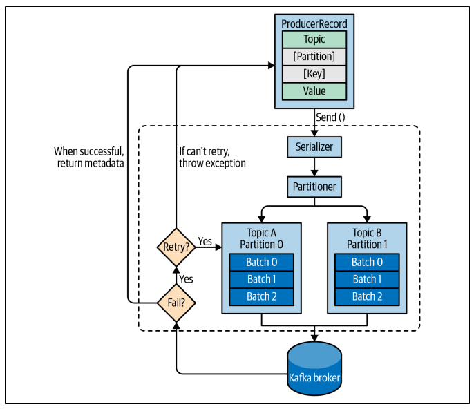

## Producer

Producers are clients that write events to Kafka. The producer specifies the topics they will write to and the producer controls how events are assigned to partitions within a topic. This can be done in a round-robin fashion for load balancing or it can be done according to some semantic partition function such as by the event key.

By default, the producer will balance messages over all partitions of a topic evenly. In some cases, the producer will direct messages to specific partitions. This is typically done using the message key and a partitioner will generate a hash of the key and map it to a specific partition.

### How it works

1. Messages are produced to Kafka by creating a ProducerRecord, which must include the **topic and a value**. Optionally, can also specify a **key, partition, timestamp, and/or a collection of headers**
2. If no partition is specified, the data will be sent to a partitioner (automatically chooses a partition based on the ProducerRecord key)
3. Once a partition is selected, the producer will know which topic and partition the record will go to, and the record wil be sent to the Kafka broker
4. If messages were successfully written to Kafka, it will return a RecordMetadata object with the topic, partition, and the offset of record within the partition
5. If the broker failed to write messages, it will return an error

## Properties

A Kafka producer has three mandatory properties.

### bootstrap.servers

List of host:port pairs of brokers that the producer will use to establish initial connection to the Kafka cluster. This list does not need to include all brokers, since the producer will get more information after the initial connection. Recommended to include at least two.

### key.serializer

Name of a class that will be used to serialize the keys of the records. Class should implement the org.apache.kafka.common.serialization.Serializer interface.

Kafka client package includes StringSerializer, IntegerSerializer, VoidSerializer, etc. If using common types, there is no need to implement your own serializers.

### value.serializer

Name of a class that will be used to serialize the values of records.

## Methods

### fire-and-forget

Sends a message to the server and doesn't care if it arrives successfully or not.

### synchronous send

Kafka producer is always asynchronous: messages sent with send() will return a Future object. For synchronous, the get() is used to wait on the Future.

### asynchronous send

Calls the send() method with a callback function, which gets triggered when it receives a response.
