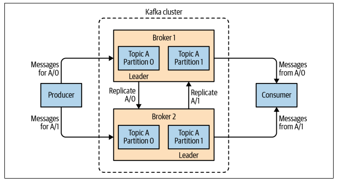

## Replication

Replication is at the heart of Kafka's architecture, and is critical as it ensures availability and durability when individual nodes inevitably fail.

Data is Kafka is organized by topics. Each topic is partitioned, and each partition can have multiple replicas. Those replicas are stored on brokers, and each broker typically stores hundreds or thousands of replicas belonging to different topics and partitions.

Replication is accomplished through setting the **topic replication factor**, which specifies the number of copies of data over multiple brokers.

Kafka **guarantees that every partition replica resides on a different broker** and hence, you cannot have multiple replicas for a single broker. If you try to create a topic with more replicas than available brokers it will fail.

https://www.confluent.io/blog/hands-free-kafka-replication-a-lesson-in-operational-simplicity/

## Leader-follower system

How will a producer know which broker to publish data to for a particular partition? To avoid the inevitable confusion of having both the actual data and its copies present in a cluster, Kafka follows a **leader-follower system**. That way, one broker can be set as the leader of a topic partition and the rest of the brokers as followers for that partition, with only the leader being able to handle those client requests.

**A partition is owned by a single broker in the cluster**, and that broker is called the **leader** of the partition. A replicated partition is assigned to additional brokers called **followers**. Replication provides redundancy, such that one of the followers can take over leadership if there is a broker failure.

### Leader replica

Each partition has a single replica designated as the leader. **All produce requests (writes) must go through the leader to guarantee consistency**. Clients can consume from **either the lead replica or its followers**.

Another task the leader is responsible for is knowing which of the follower replicas is up-to-date with the leader. Replicas send the leader Fetch requests (same type of requests that consumers send to consume messages). Those Fetch requests contain the offset of the message that the replica wants to receive next. This means that the leader can know if a replica is out-of-sync by looking at the last offset requested by each replica.

### Follower replica

All replicas for a partition that are not leaders are called followers. Unless configured otherwise, followers don't serve client requests; their main job is to replicate messages from the leader and stay up-to-date with the most recent messages the leader has. If a leader replica crashes, one of the follower replicas will be promoted to become the new leader for the partition.

The ability to read from follower replicas was added as a feature to decrease network traffic costs. To use this feature, consumer configuration should include client.rack identifying the location of the client.

The replication protocol was extended to guarantee that only committed messages will be available when consuming from a follower replica. Hence, we get the same reliability guarantees when consuming from both leader and follower replicas. For replicas to know which messages were committed by the leader, the leader includes the current **high-water mark (latest commit offset)** in the data it sends to the follower.

## In-sync replicas (ISR)

Kafka guarantees that a committed message will not be lost, as long as there is at least one in-sync replica alive at all times.

The fundamental guarantee a log replication algorithm must provide is that if it tells the client a message is committed, and the leader fails, the newly elected leader must also have that message. Kafka gives this guarantee by requiring the leader to be elected from a subset of replicas that are “in sync” with the previous leader or, in other words, caught up to the leader’s log.

The leader for every partition tracks this ISR list by computing the lag of every replica from itself. When a producer sends a message to the broker, it is written by the leader and replicated to all the partition’s replicas. A message is committed only after it has been successfully copied to all the in-sync replicas.

### Availability over consistency

if all the replicas in the in-sync replicas (ISRs) die at once, Kafka may lose data or choose an unclean leader. An unclean leader is a replica that does not have all the committed messages, but is elected as the leader anyway. This can happen if all the replicas for a partition are down, and **Kafka decides to favor availability over consistency** as the default behavior. Therefore, Kafka’s guarantee about data loss only holds if at least one replica in the ISR is alive.

