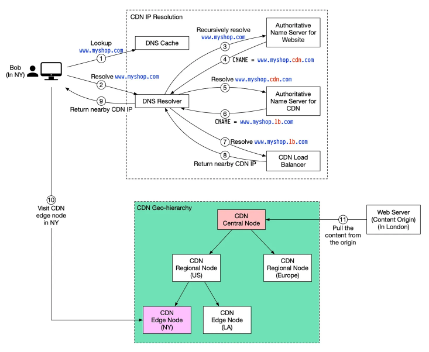

## Content Delivery Network (CDN)

A Content Delivery Network (CDN) is a geographically distributed network of servers and data centers designed to deliver web content to users more efficiently and reliably. It caches content such as images, videos, and other static assets.

The primary purpose of a CDN is to reduce latency and improve the overall performance of web applications by serving content from the server nearest to the user. CDNs can also help improve reliability, availability, and security of web applications.

## Benefits

### Reduced latency

By serving content from geographically distributed edge servers, CDNs reduce the time it takes for content to travel from the server to the user, resulting in faster page load times and improved user experience.

### Improved performance

CDNs can offload static content delivery from the origin server, freeing up resources for dynamic content generation and reducing server load. This can lead to improved overall performance for web applications.

### Enhanced reliability and availability

With multiple edge servers in different locations, CDNs can provide built-in redundancy and fault tolerance. If one server becomes unavailable, requests can be automatically rerouted to another server, ensuring continuous content delivery.

### Scalability

CDNs can handle sudden traffic spikes and large volumes of concurrent requests, making it easier to scale web applications to handle growing traffic demands.

### Security

Many CDNs offer additional security features, such as DDoS protection, Web Application Firewalls (WAF), and SSL/TLS termination at the edge, helping to safeguard web applications from various security threats.
