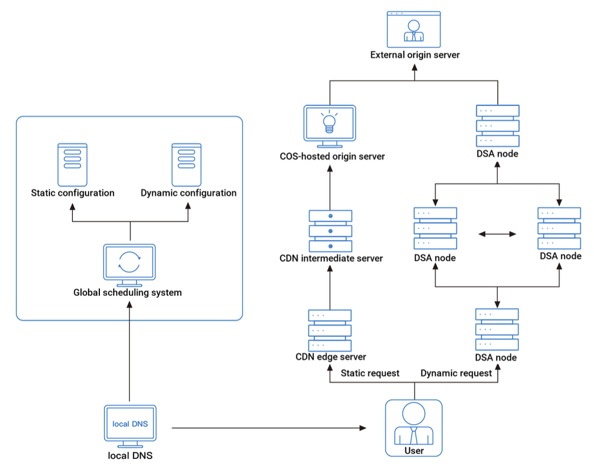
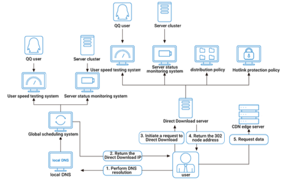

## Webpage acceleration platform

The webpage acceleration platform of Tencent Cloud CDN is optimized for webpage images by taking into account the fact that there are many dynamically requested and frequently updated small image files on webpages. It also provides acceleration policies customized for **dynamic and static content** on webpages, such as dynamic acceleration and lossless image compression.

### Platform architecture

### Global node scheduling system (GSLB)

The global scheduling system identifies the access location of the end user based on the LocalDNS access IP. It can also determine the quality of application clients, and the current load and health of nodes based on the GSLB decision-making module. It can then assign optimal nodes to end users.

### Clusters of edge and intermediate servers

A two-layer cache architecture is employed for static content, whereby request is first served by edge server that utilizes faster memory e.g. SSD, DRAM.

For dynamic content, common CDN architecture can be counterproductive. The strict request path from edge server to intermediate server in CDN may lengthen the origin-pull path and prolong the request time. Instead, a Dynamic Site Accelerator (DSA) is used to solve the problems facing dynamic request acceleration from various aspects, such as network architecture, communication technology, and hardware architecture.

When user requests for dynamic content, there is **no strict node hierarchy** through nodes assigned by the GSLB scheduling system. The request will be forwarded to the fastest transfer route from access to origin-pull. Each DSA node stores its connection information with other nodes, such as latency and packet loss rate, and assigns different weights to calculate the optimal origin-pull path.

## Download acceleration platform

The delivery of large files leads to different problems. Downloading large files incurs high bandwidth and fluctuation, while involving a variety of download tools. This brings the following common problems to users: poor download quality, low success rate, untimely software release, unstable bandwidth, poor user experience, hotlinking issues, etc.

The download acceleration platform provides fast and high-quality download services for content providers with needs for large-scale content delivery. It is mainly applicable to the following scenarios: various mobile app stores, audio/video file delivery on applications and webpages, game updates/apps/clients, firmware/hardware/software update downloads, etc.

For large files, the bandwidth will surge during passive origin-pull, leading to high pressure on the origin server. In this case, **proactive delivery** between nodes can effectively control the progress of node caching to reduce bandwidth and pressure on the origin server.

### Platform architecture

### Dedicated DNS

With dedicated DNS, Tencent Cloud CDN’s globally deployed server clusters for 302 redirect can determine the **optimal server resources for each request in real time** instead of relying on DNS scheduling and resolution, solving the scheduling problems of small ISPs and improving user access quality.

Using dedicated DNS for scheduling has zero latency, and user request can be forwarded to the optimal server node as quickly as possible while bypassing nodes with poor performance or exceptions.

Dedicated DNS works as follows:

1. A user request a URL "http://www.test.com/a.jpg". URL is resolved to the global scheduling system of CDN (GSLB)
2. GSLB returns IP of dedicated DNS server based on the user speed test system and monitoring status of the dedicated DNS server
3. User initiates a request to the dedicated DNS server
4. Scheduling system of the dedicated DNS server checks for the following:

   - Global network map from the external user speed test system i.e. network congestion and optimal connection
   - Status of servers of the monitoring system and node devices
   - File distribution policy of the configuration system
   - Hotlink protection policies of the configuration system and custom configuration system

5. Scheduling system of the dedicated DNS server selects the optimal edge server and returns HTTP request to the user through 302 redirect
6. User initiates request to the edge server. As request is made over IP, it can be protected from traffic/BGP hijacking

### Dedicated DNS vs DNS scheduling system

<table>
<tr>
<th></th>
<th>DNS Scheduling</th>
<th>Dedicated DNS</th>
</tr>
<tr>
<td>Scheduling Accuracy</td>
<td>Depends on the DNS scheduling system</td>
<td>Maintains its own IP library and can accurately identify any IP range to solve cross-ISP access problems caused by incorrect local DNS configuration, especially inaccurate scheduling with small and medium-sized ISPs</td>
</tr>
<tr>
<td>Scheduling Granularity</td>
<td>Can be accurate to the domain name level</td>
<td>Can be accurate to the domain name, directory, and URL levels</td>
</tr>
<tr>
<td>Effective Time for Scheduling Rules</td>
<td>Depends on the TTL of the domain name</td>
<td>Takes effect in real time. Traffic scheduling is precise and controllable to support businesses with traffic surges</td>
</tr>
<tr>
<td>Applicable scenarios</td>
<td>Applicable to small static resources such as webpages and images</td>
<td>Applicable to large file downloads, and supports redirection-based tracking</td>
</tr>
</table>
