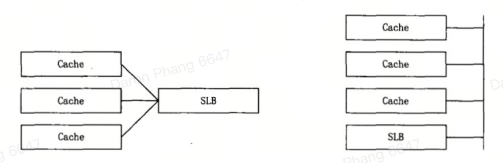

## Architecture

### Global Access Controller (GAC)

The GAC module corresponds to the load balancing system. It mainly uses an intelligent DNS resolution scheme and is responsible for scheduling user requests to the optimal service node through domain name resolution responses.

### Network Operating Center (NOC)

The NOC module corresponds to the network management sub-system. The NOC can monitor the link status, node response speed, and device operation status. Once an abnormality is found, corresponding measures will be taken to resolve it. It is an important system to ensure the security and reliability of CDN services.

### Operating Support System (OSS)

The OSS module corresponds to the operation management sub-system. It collects and summarizes the daily record information of each CCN, which is then sorted and analyzed by the central processing software, and finally published through the Client Server portal.

## Deployment architecture

The primary goal of CDN system is to minimize user access response time. Hence, the cache device that is responsible for providing content services to users should be deployed at the physical network edge location. A typical three-level deployment includes:

1. **Central layer**: Devices are responsible for global management and control in the CDN system, which also stores most content copies. The central layer may have user service capabilities, or may only provide content to subordinate nodes
2. **Regional layer**: Responsible for managing and controlling a region. Also prevents excessive pressure at the central layer if the CDN network scale is large
3. **Edge layer**: Responsible for providing content services to users

In the CDN system, not only the distribution service system and scheduling control system are deployed in a distributed manner, but also the operation management system is deployed in a hierarchical distributed manner. Each node is a generation and collection point for operation management data, and reports data through methods such as daily journals and network management agents. It can be said that CDN itself is a large-scale distributed service system with central control capabilities.

### Nodes

Nodes are the most basic deployment units in a CDN system. The CDN node network consists of CDN backbone points (central and regional nodes) and PoP points (edge nodes).

In terms of node composition, whether it is a CDN backbone point or a CDN POP point, it is composed of cache devices and local load balancing devices (SLB). Within a node, there are two ways to connect to the cache device and the SLB: bypass and traversal.

#### Bypass

Under the bypass approach, there are two ways to implement SLB.

In the early days, this SLB was generally implemented by software. SLB and cache devices both have a common IP address, and they form a parallel relationship. Users need to access the SLB device first, and then access a specific cache via **retargeting**. This implementation is simple, flexible, and has good scalability, but the disadvantage is poor security and the need to rely on retargeting at the application layer.

In the bypass mode, the configuration of the routing switching device used for forwarding messages is very important, because if the request traffic sent by the client to the server is to be received by the load balancing device first, the routing information to the virtual IP address of the load balancing device must be pre-configured on the routing switching device.

With the development of technology, L4-7 switch can also adopt the bypass deployment approach, which is attached to the routing exchange device, and data traffic is carried out through the three-way transmission method.

#### Traversal

SLB is typically implemented by **L4-7 switches**. SLB provides public IP addresses, and each cache is assigned a private IP address. All caches under the SLB form a **service group**. **SLB undertakes NAT function** by shielding the IP addresses of cache devices from the user. This provides high security and reliability.
