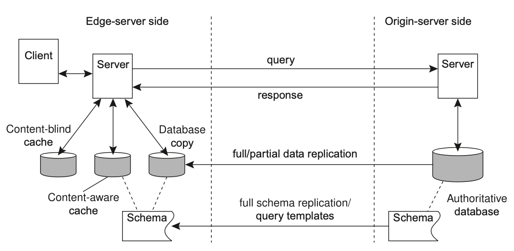

## Dynamic Content Acceleration (DSA)

Web acceleration and streaming media acceleration generally belong to the category of static content acceleration. With the rise of Web2.0, the acceleration of dynamic web, personalized content/pages/search results, and electronic transaction data has emerged. The main technologies used are:

- **Intelligent routing**: Intelligent routing algorithms are used to select the fastest and most reliable network path, avoiding congested network nodes, and improve transmission speed
- **Protocol optimization**: Optimize transmission protocol (TCP, HTTP/2) to reduce delay and data packet loss in the transmission process
- **Transmission compression**: Data compression to reduce amount of data transferred
- **Real-time optimization**: Monitor network conditions in real-time and dynamically adjust transmission paths and parameters according to network changes

A typical web system consists of three layers: presentation layer, business logic layer, and data access layer. **Dynamic content involves copying the logic and data access layers**.

## Business logic replication (edge computing)

Replicating the business logic layer is used to improve the delivery performance of dynamically generated content. This method is also known as **edge computing**.

Edge computing is used to push applications, data, and computing power (services) from a small number of centralized points in the network to logical edge locations.

## Data access layer replication

As the business logic layer depends on the data access layer, it is necessary to replicate this layer in CDN to solve scalability and performance problems when using a centralized database.

The methods for replicating data access layer are divided into two types: overall and partial replication. Partial replication can be categorized into two technologies: content-blind caching and content-aware caching.

An interesting aspect of CDNs is that they need to make a trade-off between many aspects when it comes to hosting replicated content:

- Access times for a document may be optimal if it is massively replicated
- Incurs financial cost
- Incurs bandwidth usage for disseminating updates

When considering improving performance of Web applications through caching and replication, matters are complicated by the fact that several solutions can be deployed, with no single one standing out as the best.

### Content-blind caching

The idea of content-blind caching is simple: when a client submits a query to an edge server, the server first computes a **unique hash value for that query**. Using this hash value, it subsequently looks in its cache whether it has processed this query before. If not, the query is forwarded to the origin and the result is cached before returning it to the client. Commercial products include BEA's WebLogic and IBM's WebSphere. Currently, most monetization products still use caching technology based on content-blind caching.

The key to efficiency lies in the cache hit rate. To ensure that the results of the application logic query can be frequently used by subsequent queries, an optimized query matching engine should be used.

The main advantage of this scheme is the reduced computational effort that is required from an edge server in comparison to database queries.

However, content-blind caching can be wasteful in terms of storage, as the caches may contain much more redundant data in comparison to content-aware caching or database replication. Such redundancy also complicates the process of keeping the cache up-to-date, as the origin server may need to keep an accurate account of which updates can potentially affect cached query results.

### Content-aware caching

An alternative to partial replication is to make use of content-aware caches. The basic idea is that an edge server maintains a local database that is now tailored to the type of queries that can be handled at the origin server i.e. organized according to the structure of queries and **not normalized**.

The caching of perceived content refers to selecting the storage content of source site data based on certain usage patterns, network status, and other information, and copying a part of it to the storage space of the edge server. The edge server can run its own database server and save some views in the source site database.

However, data at the edge server needs to be kept consistent, and the origin server needs to know which records are associated with which templates, so that any update of a record, or any update of a table, can be properly addressed.

### Full replication

To improve performance, we can decide to apply full replication of the data stored at the origin server. This scheme works well whenever the update ratio is low and when queries require an extensive database search. Another case for full replication is when queries are generally complex i.e. relational database with multiple table joins.

However, as this method relies too much on the local data of edge nodes, ensuring data consistency becomes particularly important. To ensure data consistency, updates need to be propagated by write operations to each replica in a timely manner. There are two methods of propagation:

- **Eager**: all replicas are involved before data update is submitted. However, this introduces performance and scalability issues
- **Lazy**: Update is propagated after it is submitted. However, a conflict resolution mechanism needs to be introduced to solve conflict between update events

Web systems usually store the main copy on a centralized source server and corresponding copies on edge server. Read operations can be performed directly on the edge server. For update operations, all database access requests will be retargeted to the main copy, which will propagate updates to each copy. The biggest challenge is that the **edge server must understand application logic** to distinguish between a write or read operation.

If there is a large number of update operations, it will cause a surge in traffic when distributing updates to edge servers during multicast operations. To improve the performance and scalability still remains a difficult challenge, and there is still a very broad research space.

## User data replication

User data is the foundation for implementing personalized, dynamic applications and content, and tracking user behavior characteristics in web systems:

1. When a user accesses a web site, the requests and related parameters (access content identification, cookies, session object information, etc.) sent by the user will be passed to the business logic layer
2. The business logic layer determines which data needs to be obtained from databases, document systems, or other external data sources, and then issues corresponding query requests to the backend data access layer
3. The business logic layer uses these results to generate a web page and returns it to the presentation layer for users to browse

### Access modes

For CDN systems, there are differences in access modes between user data and other data. This has a very critical impact on the consistency maintenance and replication strategy setting of user data.

Generally, users only interact with **one edge server**. During the existence of user session, only one edge server needs to access the corresponding user data. Hence, there is no need to replicate user data between edge servers.

If users migrate between edge servers during continuous sessions, it is necessary for the system to ensure that user's data can be migrated as users migrate. However, most of the replication strategies used in the system's backend data access layer have not been specifically optimized for this behavior, and only a few related studies have been proposed recently e.g. CONCA, Tuxedo.

### Recording user data

In addition to access mode, the recording form of user data will also have a significant impact on its acceleration method. Many websites usually use **frameset structures** to record user-customized information in order to provide more flexible page formats and layouts:

- Multiple frames are marked under the frameset tag of a user-customized index and the required page link string is introduced
- When the browser receives the user-customized index, it will parse it and automatically issue access requests to the associated pages of each frame in the frameset, and the preparation of the page content can be completed before the user actually clicks the link

For user data in this form, **edge server can cache all associated pages** defined in the user custom index and its framework. In addition, there is a more flexible user data recording method based on dynamic assembly, which assembles the customized page content requested by the user after receiving the user request.

### Privacy and security

There are two main channels for obtaining user data in the web:

- Explicitly filled out forms submitted by users
- Mining user personal information from web system daily records, cookies, user click history, and other content (transparent to users)

In order to avoid these background steps being used for unauthorized user information collection and analysis, leading to user privacy leakage, the industry has proposed many methods, such as **P3P** (Platform for Privacy Preferences). Every website that follows the P3P standard needs to provide an XML-encoded file that describes which data can be collected, how it is managed, and where it is stored. Following the P3P standard means that the site must provide sufficient privacy level protection for each copy of user data.
