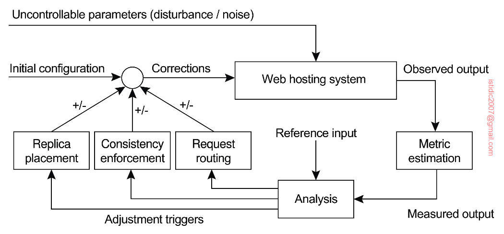

## Feedback-control loop

The sheer size of a CDN requires that hosted documents are automatically distributed and replicated. In most cases, a large-scale CDN is organized similar to a feedback-control loop.

**Negative feedback** is often implemented, which is a bias-based scheduling. When the system output is not equal to the expected value, the control system applies control to the system based on the deviation between the system output and the expected value. For example, if the actual output is greater than the expected output, a positive difference is generated, and a negative control quantity is generated e.g. reducing requests to a server if the actual request output is greater than expected.

## Metrics aggregation

Aggregating metrics can be used to estimate how well a CDN is performing. However, measuring is a complex task, and in practice, what really counts for commercial CDNs is whether they can **meet the SLAs** that have been made with customers.

### Latency

Latency refers to the time taken for an action to take place. However, this becomes difficult when a process needs to decide on the placement of replicas, as it also needs to know the delay between a client and the remote server. For such, an algorithm for globally positioning nodes will need to be deployed.

### Bandwidth

Instead of estimating latency, it may be more important to measure the available bandwidth between two nodes. This information is particularly important when large documents have to be transferred. In this case, the responsiveness of the system is largely dictated by the time that a document can be transferred. However, accurate measurements can be difficult to attain.

### Spatial

Spatial metrics consist of measuring the distance between nodes in terms of the number of network-level routing hops, or hops between autonomous systems. However, determining the number of hops can be difficult, and may not even correlate with latency.

Moreover, looking at routing tables is not going to work when low-level techniques such as Multi-Protocol Label Switching (MPLS) are deployed. MPLS circumvents network-level routing to immediately and efficiently forward packets to their destination i.e. packets may follow an entirely different route than advertised in the tables.

### Network usage

Network usage metrics often entails consumed bandwidth i.e. number of bytes transferred. However, to do this correctly, we need to consider how often the document is read, how often it is updated, and how often it is replicated.

### Consistency

Consistency metrics tells us to what extent a replica is deviating from its master copy.

### Financial

Financial metrics form another class for measuring how well a CDN is doing. As most CDNs operate on a commercial basis, it is clear that often financial metrics will be decisive. Moreover, the financial metrics are closely related to the actual infrastructure of the Internet.

## Adaptation triggering

To determine when and how adaptations are to be triggered, a simple model is to periodically estimate metrics and subsequently take measures as needed. This approach is often seen in practice.

## Managing replication

For dynamic content acceleration, it is necessary to make trade-offs between full replication and partial replication of data access layer.
