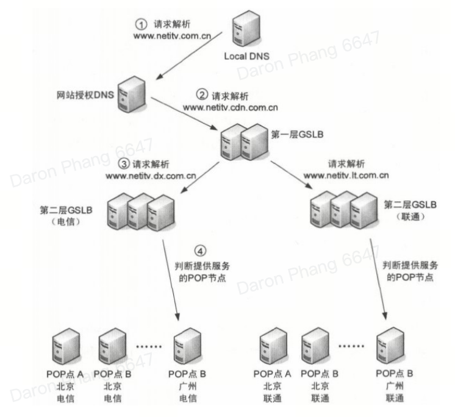

## Global Server Load Balancing (GSLB)

GSLB is a technique used by CDN providers to distribute traffic across multiple geographical **service units** to improve redundancy and performance on a global scale. It typically considers the following factors:

- Geographic proximity
- Server load
- Network conditions

GSLB is usually responsible for the **first step of load balancing** by scheduling user requests to a suitable service unit (cluster), and then the regional or local load balancing device performs the next step of load balancing. Hence, the result may directly terminate the load balancing process or hand over user access to the next level (regional or local) load balancing system for processing.

## Scheduling

**DNS resolution** is the most common scheduling mechanism.

### DNS resolution

For a CDN, the GSLB system is usually integrated into the CDN’s overall DNS infrastructure, which works alongside the standard DNS hierarchy. Also, it can largely rely on the public DNS system independent of the CDN system to complete load balancing, reducing the pressure on the CDN system itself.

When GSLB performs DNS resolution, it first selects the **service pool** based on the domain group, after which it will select the **virtual server** that provides the service. A virtual server may correspond to multiple physical servers, or the resources of a physical server may be allocated to multiple virtual servers.

To reduce the processing pressure of GSLB, **DNS caching** can be implemented. This is one of the reasons why many commercial CDNs choose the DNS mechanism for global load balancing.

#### CNAME

CNAME method is the most commonly used method in the industry. Load balancing is achieved through CNAME as follows:

1. Hostname of GSLB is added as an alias of the authoritative nameserver
2. Multiple A records are added to the GSLB hostname, corresponding to the IP addresses of multiple servers
3. Local DNS returns multiple IP addresses as the query result, in which the order can be rotated
4. Clients generally choose the first IP address for access

#### Negative equalizer as authoritative DNS server

This approach treats the load balancer as an authoritative DNS nameserver:

- In a CDN setup, the authoritative DNS servers are managed by the CDN provider and integrate the GSLB system
- The GSLB receives the DNS query and analyzes it based on heuristics for intelligent DNS resolution e.g. user's location, server load, network conditions, etc.
- Based on the analysis, it selects the optimal CDN edge server to handle the request and returns its IP address to the local DNS resolver/recursor

#### Proxy DNS server

In this approach, the load balancer is registered as an authoritative DNS nameserver in the domain namespace, but the real authoritative nameservers are deployed behind the LB:

- All DNS requests arrive at the LB
- LB forwards request to the real authoritative nameservers
- Response is modified to implement the load balancing function

### HTTP retargeting

1. User requests domain name resolution for www.CDNbook.com from local DNS
2. CNAME points to GSLB of CDN. Local DNS returns IP address of GSLB to user (IP address can be either a specific address or an address that is returned by the GSLB load balancer)
3. User initiates GET request to GSLB for requesting some content of a webpage. Multiple HTTP requests are initiated for different content e.g. picture, video, text
4. GSLB performs smart scheduling by analyzing real-time information such as IP address, device load, link status, content distribution, etc. GSLB selects a suitable **service unit (regional or local load balancing device)** for the user, and returns 302 retargeting response
5. If GSLB cannot find the information, it completes the routing strategy in two ways:
   - GSLB directs user requests to other nodes through polling
   - GSLB checks dynamic nearest path table

### Anycast routing

GSLB based on IP routing is recommended for use in a metropolitan area network or autonomous domain using **IGP protocol**. This is because it is difficult to achieve nationwide load balancing across autonomous domains using BGP protocol, as most BGP routers do not maintain routes for a single host.

However, in order for this to work properly, each router must maintain a host route to VIP. In this way, it is required that the CDN service provider using this GSLB scheme coordinate with the operator to route the router for a certain VIP host. This negotiation is likely to be unacceptable to the operator, which is also a limitation of the implementation of this scheme.

## Layers and routing

GSLB is usually divided into two logical layers:

- First: Distinguishes between different telecom operator networks by IP range
- Second: Distinguishes between different provinces by IP range

How it works:

1. User accesses www.netitv.com.cn
2. Authoritative DNS transfers the CNAME to the first-layer GSLB device (www.netitv.cdn.com.cn)
3. First-layer examines local domain group settings, judges whether the user is from telecom or unicom, and transfers to the second-layer
4. Second-layer determines which province the user is from based on the user's local DNS address, finds all PoP nodes deployed in the province, and uses load balancing strategy to select the best PoP node

## GRM (Global Resource Management) and LRM (Local Resource Management)

GSLB based purely on DNS can only complete proximity judgement. To achieve intelligent scheduling, most solutions need to **deploy an auxiliary GRM device in a bypass manner near the GSLB device** for:

- Communicating with the LRM device of each PoP node once in a while
- Completing the CDN status check of each PoP node
- Re-formulating the user scheduling strategy based on status and traffic situation of the PoP node, and sending the strategy back to GSLB for execution in real-time

Since the load balancing strategy of GSLB needs information from GRM, LRM and SLB, if there are any errors in communication between them, the following abnormal situations will occur:

- If the LRM fails, GRM will no longer update scheduling policy to GSLB; falls back to default mode by using a more common strategy
- If the SLB fails, the LRM device sends an alarm and notifies the GRM device. The GRM device generates a new scheduling policy and **directly schedules** user requests to the PoP node

## Network attacks

As DNS service adopts UDP-based and connectionless access method, it brings greater convenience to distributed attacks. This situation can be avoided by deploying **hidden nodes**.

The implementation works by deploying a backup GSLB device. When the primary GSLB is under attack, the hidden backup GSLB device is exposed and published as a service device to ensure the system can continue functioning.
