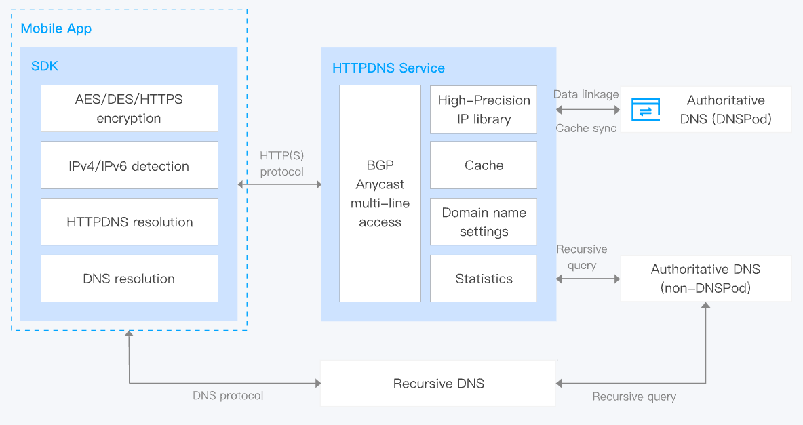

## HTTPDNS

With the emerging and development of low-latency applications (such as autonomous driving, SmartCity, telemedicine), low-latency has become one of the key requirements of current network services, especially in edge computing and 5G network. While under the state-of-the-art architecture, the request resolution is provided by Internet Service Provider's localDNS, which assigns a specific edge server for each request, but this method is now suffering from inaccurate scheduling problem, and fails to adapt to network changes due to the relatively fixed allocation strategy. These drawbacks result in the long response latency, and are becoming more severe in nowadays 5G edge networks.

HTTPDNS is a domain name resolution service for apps on multiple types of platforms, such as mobile apps and desktop apps. It resolves domain names over HTTP or HTTPS instead of the traditional localDNS. This can effectively prevent domain hijacking, improve the accuracy and stability of domain name resolution, and provide quick updates of resolution results.

Under such architecture, instead of going through local DNS, a user's request is directly transmitted to HTTPDNS servers, which will then allocate a specific edge server for this request. With a server scoring module, the proposed HTTPDNS architecture can finally ensure user requests be guided to the optimal edge server.

## Benefits

### Protection against domain hijacking

DNS requests are sent directly to the HTTPDNS server, bypassing the ISP's local DNS. HTTPDNS also supports AES/DES/HTTPS encryption methods, making the query process more secure. This helps to prevent domain name hijacking and cross-network access problems caused by local DNS and eliminate DNS exceptions in mobile internet services.

### Precise/smart scheduling

Due to the diverse policies of ISPs, clients may be unable to access the nearest or optimal points of presence (POPs) based on the resolution results of local DNS servers.

In contrast, HTTPDNS can obtain the real IP address of a client and then provide the most accurate resolution result based on the IP address. This allows the client to access the nearest PoP. If any exceptions occur, DNS requests can still be sent to the ISP's local DNS over the DNS protocol.

### Low latency

HTTPDNS makes use of client-specific policies such as pre-resolution of hotspot domain names, caching of DNS resolution results, and lazy loading of resolution results to implement domain name resolution at low latencies (down to milliseconds).

### High scalability

Software-defined DNS (SDNS) allows more controllable traffic scheduling.

### High stability and reliability

HTTPDNS has a minimum service availability of 99.99%, ensuring that the DNS service is highly stable and reliable.
