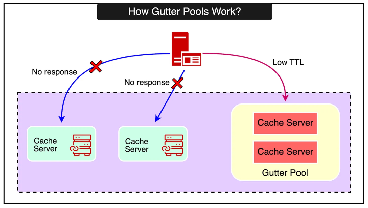

## Overview

Read operations will fetch data from a variety of sources (databases, HDFS, etc.). This heterogeneity requires a flexible caching strategy to store data from disparate sources.

Key lessons from building, maintaining and evolving cache systems:

- Separating cache from persistent storage systems allows us to independently scale them
- Features that improve monitoring, debugging and operational efficiency are as important as performance
- Managing stateful components is operationally more complex than stateless ones; keeping logic in a stateless client helps iterate on features and minimize disruption
- Simplicity is vital

## Cache replicas

For your cache, you want as few replicas as possible with lots of resources for each replica e.g. instead of 10 replicas with 1GB of RAM, you would want 2 replicas with 5GB of RAM.

This is preferable because having more replicas would result in the following:

- Same set of data will be stored across all replicas, reducing the overall cache data that you can keep in memory
- Reduces hit rate (fraction of time that a request can be served out of cache)
- Decreases utility of cache

## Dedicated pools

Using cache as a general-purpose caching layer requires workloads to share infrastructure despite different access patterns, memory footprints, and quality-of-service requirements. Different applications’ workloads can produce negative interference resulting in decreased hit rates.

Moreover, items with different churn characteristics interact in an unfortunate way: low-churn keys that are still valuable are evicted before high-churn keys that are no longer being accessed.

To accommodate these differences, can partition a cluster of cache servers into separate pools:

- A wildcard pool as the default (storing any key)
- Separate pools for keys whose residence in wildcard is problematic
- Small pool for keys that are accessed frequently but for which a cache miss is inexpensive
- Large pool for infrequently accessed keys for which cache misses are expensive

This strategy involves:

- Analyzing data access patterns
- Identifying crucial datasets
- Allocating dedicated memory to each pool to prevent critical data from being evicted under high memory pressure
- Tailoring eviction policies i.e. more expensive data have longer TTL

### Replication

Within some pools, replication can be used to improve the latency and efficiency of cache servers. Criteria for choosing to replicate a category of keys within a pool:

1. The application routinely fetches many keys simultaneously
2. Entire data set fits into one or two memcached servers
3. Request rate is much higher than what a single server can manage

**Replication is favored over dividing the key space** as follows:

- Assume each request asks for 100 keys
- Overhead for retrieving 1 key vs 100 keys is small
- Clients will need to split each request into two parallel requests for ~50 keys
- If all 100 keys are replicated, it reduces the load per server by half
- Clients can also send requests to any replica

## Handling failures

The inability to fetch data from cache can result in excessive load to backend services that could cause further cascading failures. There are two scales at which failures must be addressed:

1. A small number of hosts are inaccessible due to network or server failure
2. A widespread outage that affects a significant percentage of servers within the cluster

### Handling widespread outages

If an entire cluster has to be taken offline, user requests are diverted to other clusters which effectively removes all the load from cache server.

### Automated remediation for small outages

An automated remediation system that automatically detects and responds to host-level issues can be used to bring up new instances to replace affected ones. However, this process is not instantaneous and can take some time. During this window, the backend services my experience a surge of requests as clients attempt to fetch data from unavailable cache hosts.

A common approach is to rehash keys and distribute them among the remaining cache servers. However, such an approach **risks cascading failures due to non-uniform key access frequency**. For example, a single key can account for 20% of a server's requests. Moving high-traffic keys to another server during a failure scenario could result in overload and further instability.

To mitigate such risk, there are two approaches: mirrored pool and gutter pool.

### Mirrored pool

A fully synchronized secondary cache pool that receives all writes and can immediately take over reads if the primary pool fails.

### Gutter pool

A small, empty cache pool that temporarily caches values with a short TTL when the primary pool fails, reducing the load on the backend until the primary recovers. Gutters limits the load on the backend services at the cost of slightly stale data.

### Smaller vs bigger servers

Having smaller servers provides benefits including:

- **Granular failure impact**: Failure of a single server affects a smaller portion of cached data
- **Faster warmup**: Cache can warm up faster for the failed server's key space due to smaller data volume

On the other hand, having larger servers provide the following benefits:

- **Simplified management**: Fewer servers are easier to manage and maintain, with less moving parts and complexity in the overall system
- **Improved resource utilization**: Larger servers can more effectively utilize CPU, memory and network resources
- **Fewer connections**: With fewer cache servers, the total number of connections from clients is reduced, minimizing connection overhead

## Sharded file storage

Common file systems use contiguous storage. When the file system size reaches the threshold, an old file may need to be deleted before a new file can be received. However, this is an issue if an old 1GB file needs to be deleted to store a 4KB file.

Instead, all large files can be divided into smaller data shards for storage. As such, only data shards need to be deleted if needed. When the original large file is requested, only the deleted shards need to be obtained again. This solves the problem where the cache file system generates high origin-pull traffic when deleting large files.
