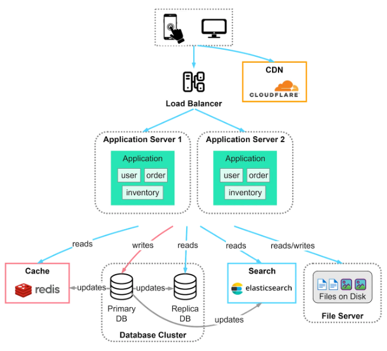

## Challenges with low latency database reads

- Data retrieval speed from a disk has a threshold; beyond that, you cannot squeeze out more performance regardless of optimization on data model or queries
- Vertical scaling can take you far but assigning more resources by upgrading to better hosts has limitations
- Horizontal scaling by splitting your database into multiple partitions is a promising approach; however, it gets more operationally complex and doesn't eliminate issues such as **hot partitions**
- Both horizontal and vertical scaling are costly in the long term

## Caching

Caching is a technique used to improve the performance and efficiency of a system. It involves storing a copy of certain data in a temporary storage area (the cache) so that future requests for that data can be served faster.

Caches can exist at all levels in architecture, but are often found at the level nearest to the front end, where they are implemented to return data quickly without taxing downstream levels.

Scope of caching typically applies to local storage or a specific system.



## Performance indicators

### Cache ratio

```
cache hits / (cache hits + cache miss)
```

### Cache evictions

Monitor the number of evictions occurring in the cache. Frequent evictions might suggest the cache is too small or the eviction policy is not optimal for your use case.

## Caching strategies

### Client caching

Client-side caching stores data on the client’s device e.g. browser, mobile app. When a user revisits a site, the browser can load the site from the local cache rather than fetching everything from the server again.

The cache-control header directive tells the browser the duration to cache the file e.g. 1h.

### Server caching

Server caching involves storing frequently accessed data on the server, reducing the need for expensive operations like database queries.

Server-side caches are stored on the server itself or a separate cache server, either in memory (like Redis) or on disk. Typically, the server checks the cache for data before querying the database. If the data is in the cache, it is returned directly.

### Database caching

Database caching stands as a cornerstone in the realm of caching strategies, playing a pivotal role in enhancing the performance of applications that heavily rely on database interactions.

Database caching can be implemented in two primary ways:

- Internal Caching: This is where the database system itself maintains a cache. It’s akin to having a quick reference guide built right into the database
- External Caching: In this approach, an external cache (like Redis or Memcached) works in tandem with the database

### Content Delivery Networks (CDNs)

CDNs are a network of servers distributed geographically, generally used to serve static content such as JavaScript, HTML, CSS, images, and video assets. They cache the content from the original server and deliver it to users from the nearest CDN server.
