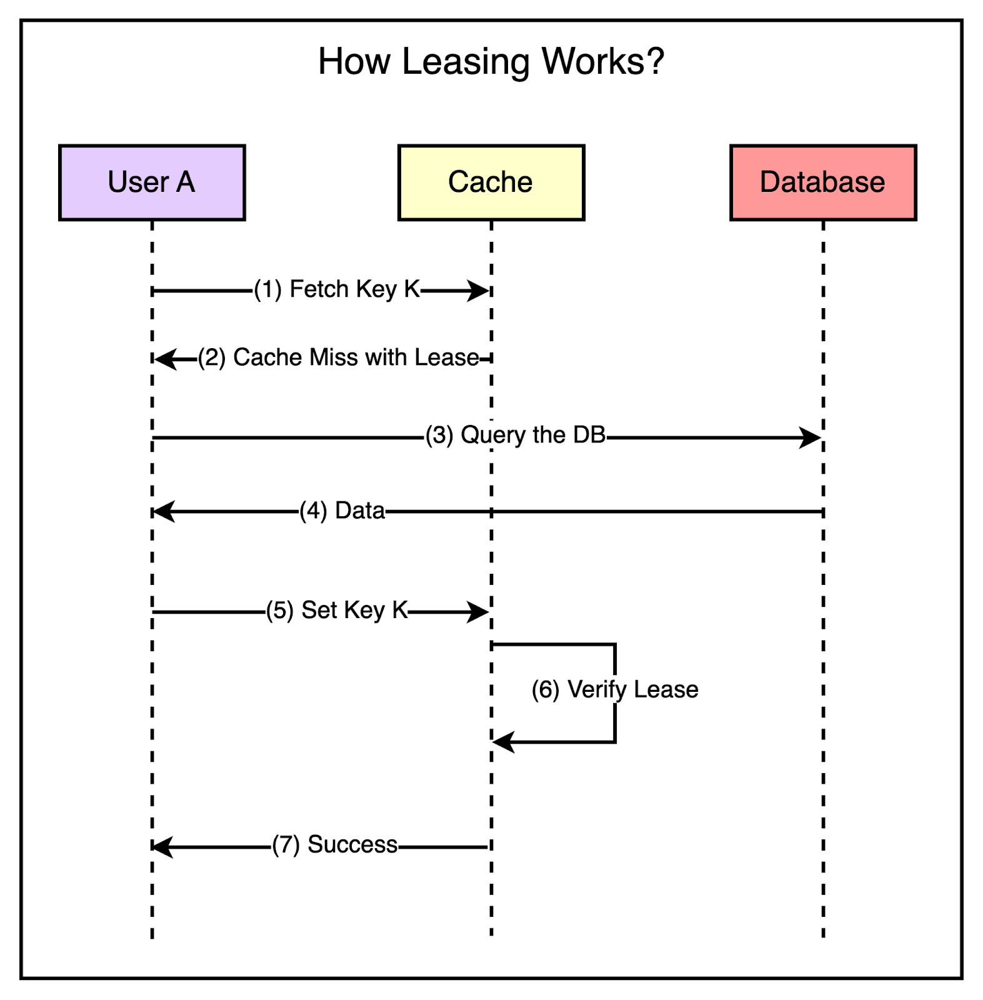

## Stale sets and thundering herds

**Stale set** happens when the cache is set with outdated data and there’s no easy way of invalidating it. This can occur when concurrent updates to cache gets reordered.

A **thundering herd** happens when a specific key undergoes heavy read and write activity. As the write activity repeatedly invalidates the recently set values, many reads default to the more costly path. This problem can also occur in a highly concurrent environment when a cache miss triggers a thundering herd of requests to the database.

### Leasing

Leasing can help to solve both stale sets and thundering herds. With leasing, cache provides a lease (token bound to a specific key) to a particular client to set data into the cache whenever there is a cache miss.

The client has to provide this token when setting the value in the cache and it can verify whether the data should be stored by verifying the token. If the item was already invalidated by the time the client tried to update, the cache will invalidate the lease token and reject the request. Verification can also fail if the cache has invalidated the lease token due to receiving a DELETE request for that key.

The cache can also regulate the rate of issuing the lease tokens. For example, it may return a token once every 5 seconds per key.

For any requests for the key within 5 seconds of the lease token being issued, the cache sends a special response requesting the client to wait and retry so that these requests don’t hit the database needlessly. This is because there’s a high probability that the client holding the lease token will soon update the cache and the waiting clients will get a cache hit when they retry.

## Handling hot keys

Hot keys are a common challenge in caching systems. They refer to keys that are accessed more frequently than others, leading to a high concentration of requests on a single cache server and causing performance issues and overloading.

### Key splitting

- Key splitting involves distributing the load of a hot key across multiple servers
- Instead of having a single key, the key is split into multiple versions, such as keyX/1, keyX/2, keyX/3, etc.
- Each version of the key is placed on a different server, effectively spreading the load
- Clients read from one version of the key (usually determined by their client ID) but write to all versions to maintain consistency
- The challenge with key splitting is detecting hot keys in real time and coordinating the splitting process across all clients
- It requires a pipeline to identify hot keys, determine the splitting factor, and ensure that all clients perform the splitting simultaneously to avoid inconsistencies
- The list of hot keys is dynamic and can change based on real-life events or trends, so the detection and splitting process needs to be responsive

### Local caching

Local caching is simpler when compared to key splitting:

- Local caching involves **caching hot keys directly on the client-side**, rather than relying solely on the distributed cache
- A key is cached locally on the client with a short TTL (Time-To-Live) when a key is identified as hot
- Subsequent requests for that key are served from the local cache, reducing the load on the distributed cache servers
- Local caching doesn't require coordination among clients
- However, local caching provides weaker consistency guarantees since the locally cached data may become stale if updates occur frequently
- To mitigate this, it’s important to use short TTLs for locally cached keys and only apply local caching to data that changes rarely

## Maintaining cache consistency

Maintaining data consistency is one of the biggest challenges when using caching in distributed systems. Keeping data in-sync across multiple locations in the face of concurrent reads and writes is a non-trivial problem.

### Consistent CRUD operations

For add operations, it should only succeed if the key doesn't already exist to avoid overwriting newer values.

For updates:

1. Before an update, the cache entry's TTL is reduced to a lower value e.g. 30 seconds
2. Update data in the primary data store
3. After the update, update the cache with the newer value and reset TTL

If a failure occurs between steps 1 and 2, the cache remains consistent as the update never reaches the primary store. If a failure occurs between 2 and 3, the cache will be stale, but only for a short time until the reduced TTL expires.
