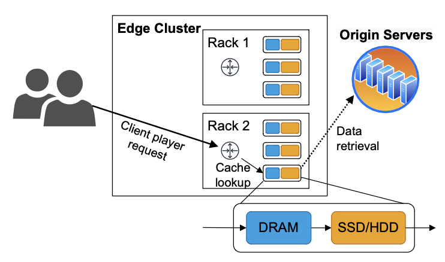
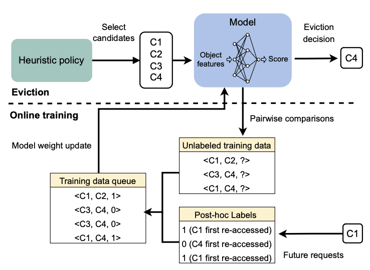

## HALP (Heuristic Aided Learned Preference) eviction policy for Youtube CDN

HALP is a novel caching algorithm which achieves low CPU overhead and robust byte miss ratio improvement by augmenting a heuristic policy with machine learning.

The key insight of HALP is to augment a **preexisting heuristic caching policy with machine learning**, using the heuristic policy to pick candidates for eviction and the ML model to decide which candidate to evict.

## Architecture

Youtube CDN contains edge clusters spreading more than 200 countries and territories globally:

- An edge cluster consists of multiple racks
- Each rack contains multiple cache servers configured **homogeneously** using the same type of machines
- Servers from different racks may have hardware from different generations
- Each cache server is equipped with DRAM, SSDs and HDDs used for caching data chunks

Client player requests are sharded amongst machines in an edge cluster:

1. A request includes a key and byte range of a data chunk. As a video is played sequentially, video range requests are issued sequentially
2. Server checks if the requested data chunk is in its DRAM. If missed, data will be fetched from other cache layers (e.g. SSDs, HDDs), with the remote origin server as the last resort
3. When DRAM is full and a miss occurs, an eviction algorithm is used to remove data chunks from teh cache to insert new data chunks

## Eviction policy design

A key component of HALP is a **neural network based score function**, whose inputs correspond to the features for a single eviction candidate, and whose output is a real valued score which tracks the likelihood of a quick re-access to the same object.

HALP can be deployed without the operational overhead of having to separately manage the labeled examples, training procedure and the model versions in separate offline pipelines. Hence, HALP has minimal extra overhead for operation similar to other heuristic policies, but has the added benefit of being able to take advantage of additional features to make its eviction decisions and continuously adapt to a changing access patterns.

### How it works

1. When an eviction is required, a heuristic policy (e.g., LRU) is used to propose a small set of eviction candidates
2. A neural network-based model re-ranks the eviction candidates and selects the final eviction decision by pairwise comparisons
3. The same pairwise comparisons are also used to generate training data for online training

### Heuristic-based candidate selection

A key insight for ensuring a low overhead is that many objects can be easily excluded from eviction consideration without the need to use expensive computations. Hence, a heuristic policy (e.g. LRU, LFU, etc.) can be used for candidate selection to reduce ML computation overhead. It also provides a lower limit on decision quality.

The number of eviction candidates is a hyperparameter. If too many candidates are selected, the ML pipeline overhead will be too high. But too few candidates may lead to not a single good candidate to evict. We find empirically selecting **four candidates** achieves a good balance between the recall of good candidates and the incurred CPU overhead.

## Impact distribution analysis

Comparing cache algorithms may seem like a straightforward hypothesis test over an A/B testing experiment. However, the **operating conditions in a large-scale system could be very diverse**, and understanding the robustness of an improvement is critical to decision making in practice.

For example, a new algorithm may be beneficial for most machines but performs extremely poorly for some small set of machines. In this case, applying it everywhere could be sub-optimal. Any algorithms without a theoretical performance lower-bound have these risks, but the concern is exacerbated for learning algorithms that are prone to over-fitting.

A naive approach to the diversity problem is to enumerate all configurations and perform separate A/B tests (e.g. one test for each rack where workload and hardware is assumed to be similar). However, this severely limits the number of data points, and the signal to noise ratio for each configuration could be very poor in a production setting.

To get a more holistic picture of how a new algorithm is affecting the fleet, instead of estimating the average performance change, we estimate the **distribution of performance changes across different conditions**.

### Measurement setup

The key insight of our impact distribution analysis is modeling machine level measurement noise by comparing machines with HALP deployed against no-op machines.

Machines are randomly split in a rack into three different configurations:

- Experiment machines: Use the HALP algorithm
- No-op machines: Use the baseline caching algorithm; they are used to measure the production environment noise
- Control machines: Use the baseline caching algorithm; selected as the baseline to compare with experiment group and no-op group
