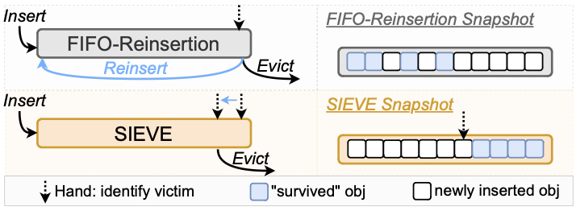

## SIEVE

SIEVE is a turn-key cache eviction policy and is an easy improvement to FIFO-reinsertion algorithm that materially improves its efficiency across a wide range of web cache workloads.

Despite a simple design that efficiently achieves both **lazy promotion and quick demotion**, SIEVE can quickly remove unpopular objects from the cache, achieving comparatively high efficiency compared to the state-of-the-art algorithms. Moreover, SIEVE’s design eliminates the need for locking during cache hits, resulting in a boost in multi-threaded throughput.

## Design

### Data structure

- SIEVE requires only one FIFO queue and one pointer called “hand”
- The queue maintains the insertion order between objects
- Each object in the queue uses one bit to track the visited/non-visited status
- SIEVE inserts new objects at the head of the queue
- The hand points to the next eviction candidate in the cache and moves from the tail to the head
- Retained objects are kept at their position
- Unlike existing algorithms in which the eviction candidate is the tail object, the eviction candidate in SIEVE is an object somewhere in the queue

Since SIEVE inserts new objects at head, and objects that are retained remain in their original positions, the algorithm **implicitly partitions** the cache between new and old objects.



### Operations

1. Objects are inserted into the **head** of the queue
2. A cache hit in SIEVE changes the visited bit of the accessed object to 1. For a popular object whose visited bit is already 1, SIEVE does not need to perform any operation
3. During a cache miss, SIEVE examines the object pointed by the hand. The hand moves from the **tail to the head**. If it has been visited, the visited bit is reset, and the hand moves to the next position. It continues this process until it encounters an object with the visited bit being 0, and it evicts the object
4. After the eviction, the hand points to the next position (the previous object in the queue)

## Pseudo algorithm

```
# Input: The request x, doubly-linked queue T , cache size C, hand p
if x is in T then:
    x.visited = 1
else:
    if len(T) == C then
        o = p
        if o is NULL then
            o = tail of T
        while o.visited = 1 do
            o.visited = 0
            o = o.prev
            if o is NULL then
                o = tail of T

        p = o.prev
        Discard o in T

    Insert x in the head of T
    x.visited = 0
```

## Performance

At the large cache size, SIEVE demonstrates the most significant reductions across nearly all percentiles.

However, when the cache is very small, other algorithms may outperform SIEVE. The poor performance is because new objects cannot demonstrate their popularity before being evicted when the cache size is very small.

SIEVE does not require promotion at each cache hit. Hence, it is faster and more scalable.

## Challenges

### SIEVE is not scan-resistant

In block cache workloads, SIEVE sometimes may show a higher miss ratio than LRU. The primary reason for this discrepancy is that SIEVE is **not scan-resistant**.

In block cache workloads, which frequently feature scans, popular objects often intermingle with objects from scans. Consequently, both types of objects are rapidly evicted after insertion. As SIEVE does not use a **ghost cache**, it cannot recognize the popular objects when they are requested again. A ghost cache is a shadow cache that keeps track of recently evicted items to make smarter future eviction decisions. This problem is less severe on large cache size. However, when the cache size is small, having a ghost cache is critical to be scan-resistant.
