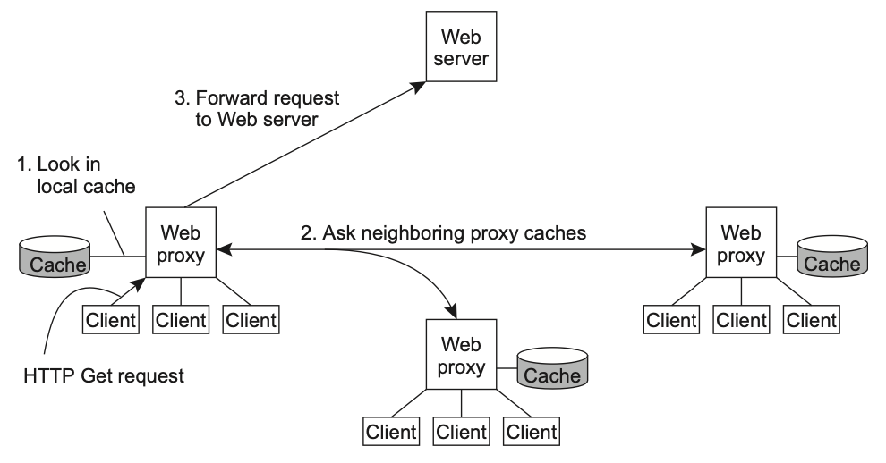

## Hierarchical caching

Hierarchical caching is a strategy used in computer systems to improve performance by organizing **cache memory** in a multi-layered structure. Instead of relying on a single cache, hierarchical caching employs multiple levels of caches, each with varying sizes and speeds.

### Two-layer cache

An example is a two-layer cache architecture in edge servers and intermediate servers, whereby cache servers in the cluster are divided into two layers:

- Cache servers at layer 1 mount DRAM or SSD disks to balance speed and processing accuracy
- Cache servers at layer 2 mount HDD disks to store massive amount of data; if cache miss occurs at layer 1, data request will be sent to layer 2

This solution greatly improves the hit rate of edge servers, while ensuring fast processing and reads of high volumes of small files. It also has a similar capability as that of a nearby intermediate server, enabling it to meet the storage needs of large files, achieving an optimal balance between storage and efficiency.

## Cooperative caching (distributed caching)

An alternative to building hierarchical caches is using cooperative caching, where **multiple nodes work together to share cached data**. Whenever a cache miss occurs at a web proxy, the proxy first checks a number of neighboring proxies to see if one of them contains the requested document. If such a check fails, the proxy forwards the request to the Web server responsible for the document. In a highly decentralized system, cooperative caching is highly effective.

### Benefits

- **Reduced latency**: By allowing nodes to cooperate, cooperative caching can reduce the time it takes to retrieve data, especially when the requested data is already cached elsewhere
- **Load balancing**: Distributing cache hits across multiple nodes can help balance the load, preventing any single node from becoming a bottleneck while also alleviating pressure on the main data source
- **Dynamic adaptation**: Systems using cooperative caching can adapt to changing access patterns and node availability, dynamically adjusting which data to cache and how to share it among nodes
