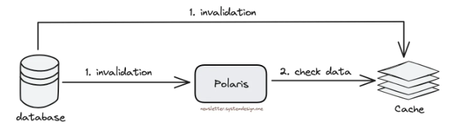

## Cache invalidation

Cache invalidation is one of the two hard things in Computer Science.

## Time-to-Live (TTL)

One of the simplest cache invalidation strategies is configuring an **expiration strategy** like a TTL and letting the cache entries expire once they cross the TTL.

While this can work for many cases, most users expect changes to be reflected faster than the TTL. However, lowering the default TTL to a very small value can sink the cache hit rate and reduce its effectiveness.

## Data capture and streaming

You can tail the database's binlog events and publish the events to a list of consumers.

For cache invalidation, a new consumer was created that subscribes to the data events and invalidates/upserts the new rows in Redis.

Key advantages of this approach include:

- They could make the cache consistent with the database within seconds of the database change as opposed to minutes (depending on TTL)
- Using binlogs made sure that uncommitted transactions couldn’t pollute the cache

## Cache control headers

Cache control headers are used by the origin server to provide instructions to the CDN regarding caching behavior. These headers can dictate the cacheability of content, its TTL, and other caching-related settings.

## Write-through cache

Data is written into the cache and the corresponding database simultaneously. There is complete data consistency between cache and storage, but results in higher latency for write operations.

## Write-around cache

Write directly goes to the database or permanent storage, bypassing the cache. It may reduce latency but increases cache misses.

## Write-back cache

Write is only done to the caching layer and the write is confirmed as soon as the write to the cache completes. The cache then asynchronously syncs this write to the database.

There is a risk of data loss in case the caching layer crashes. We can improve this by having more than one replica acknowledging the write in the cache.

## Observability through monitoring and tracing

Observability can be used to improve cache inconsistency by finding when to invalidate cache. This can be done by creating a service to monitor cache inconsistency:

- Acts like a cache server to find data inconsistency by querying cache servers
- Queues inconsistent cache servers and checks again later
- Checks data correctness during writes, so finding cache inconsistency is faster

Debugging a distributed cache without logs is hard. However, logging every data change isn't scalable as it is write-heavy. This can be resolved by using a tracing library and embedding it on each cache server:

- Logs only data changes that occur during the race condition time window
- Keeps an index of recently modified data to determine if the next data change must be logged
- Observability service will read the logs and check if cache inconsistency is found
