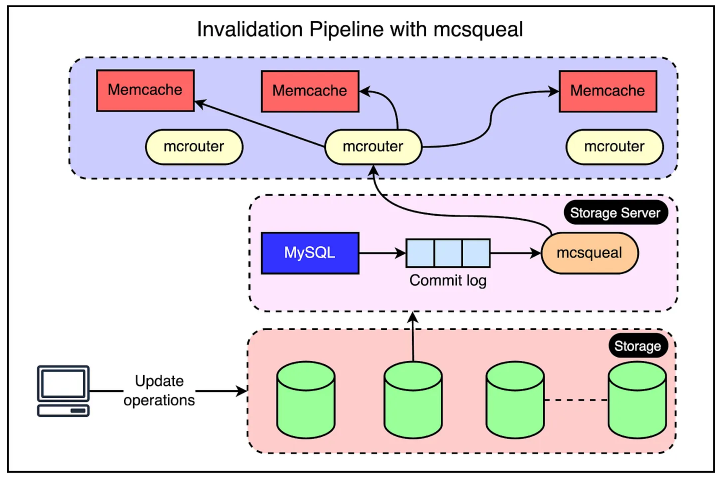

## Cache invalidation

Cache invalidation is one of the two hard things in Computer Science. If the data is modified in the database, it should be invalidated in the cache. Otherwise, this can cause inconsistent application behavior.

### Time-to-Live (TTL)

One of the simplest cache invalidation strategies is configuring an **expiration strategy** like a TTL and letting the cache entries expire once they cross the TTL.

While this can work for many cases, most users expect changes to be reflected faster than the TTL. However, lowering the default TTL to a very small value can sink the cache hit rate and reduce its effectiveness.

### Cache control headers

Cache control headers are used by the origin server to provide instructions to the CDN regarding caching behavior. These headers can dictate the cacheability of content, its TTL, and other caching-related settings.

### Purging

The purge method removes cached content for a specific object. When a purge request is received, the cached content is immediately removed, and the next request for the content will be served directly from the origin server.

### Stale-while-revalidate

This method is used in web browsers and CDNs to serve stale content from the cache while the content is being updated in the background. When a request is received for a piece of content, the cached version is immediately served to the user, and an asynchronous request is made to the origin server to fetch the latest version of the content. Once the latest version is available, the cached version is updated. This method ensures that the user is always served content quickly, even if the cached version is slightly outdated.

### Data capture and streaming through invalidation daemon

A web server that modifies its data must also send invalidations to its own cluster to provide read-after-write semantics, and reduce the amount of time stale data is present in its local cache.

Invalidation daemons can be deployed on every database that **tail the database's binlog events** and broadcast them to every cluster. Key advantages of this approach include:

- They could make the cache consistent with the database within seconds of the database change as opposed to minutes (depending on TTL)
- Using binlogs made sure that uncommitted transactions couldn’t pollute the cache

Though web servers can broadcast invalidations directly to cache servers, this approach suffers from two problems:

- It incurs more packet overhead as web servers are less effective at batching invalidations
- A systemic invalidation problem arises in the event of misrouting of deletes due to a configuration error

