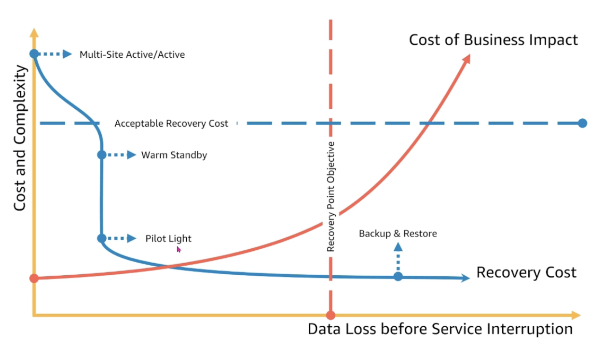
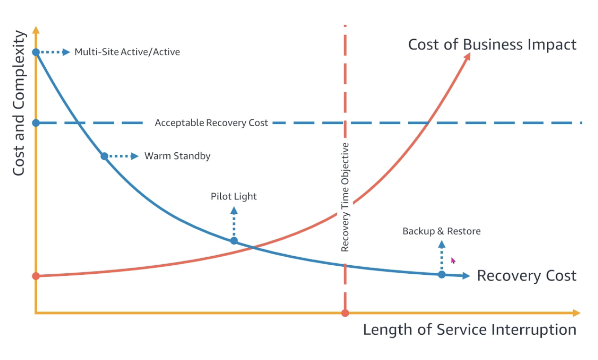

## Recovery Point Objective (RPO)

Maximum tolerable period in which data might be lost due to a major incident.

## Recovery Time Objective (RTO)

Targeted duration of time within which a business process must be restored in order to avoid unacceptable consequences.

## Disaster recovery

Disaster recovery is the largest of the reliability events because it involves an entire geographic region being unavailable. There are four models of disaster recovery. It is part of business continuity.

### Backup and restore (active/passive)

- RTO/RPO in hours
- Lower priority use cases
- Provision all AWS resources after event
- Lowest cost

### Pilot light (active/passive)

- RTO/RPO in minutes
- Live data
- Idle services but are not taking any traffic
- Provision some AWS resources and scale after event

### Warm standby (active/active)

- RTO/RPO in minutes
- Always running but smaller scale
- Takes in a small percentage of the traffic e.g. 20%
- Business critical
- Scales AWS resources after event

### Multi-site (active/active)

- RPO/RTO in real-time
- Zero downtime
- Near zero data loss
- Mission critical services
- Most expensive

## RPO and models

## RTO and models

