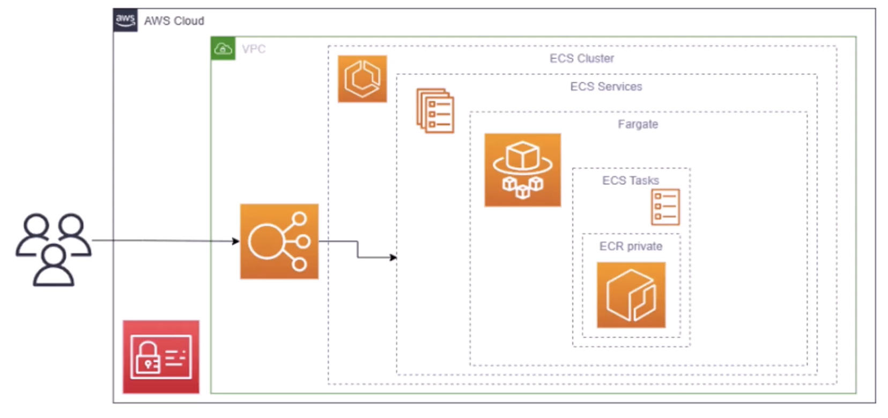

## Lightsail

Enables a VPS to be launched and managed with ease. It is a simpler alternative to using EC2, RDS, ELB, EBS, Route 53, etc. It is great for people with minimal cloud experience.

It has high availability but no auto-scaling, and limited AWS integrations with other resources.

### Features

- Virtual servers with pre-configured blueprints e.g. WordPress, Django, Nginx, MEAN, etc.
- Container deployment
- Load balancers
- Managed databases
- Global CDN

## Amazon Elastic Container Service (ECS)

Containers provide you a standard way to package your application's code and dependencies into a single object. You can use containers for processes and workflows in which there are essential requirements for security, reliability and scalability.

AWS ECS is a highly scalable, high-performance container management system that enables you to run and scale containerized applications on AWS. However, you still need to manage the underlying infrastructure. - A load balancer can be assigned to route external traffic to your service.

ECS supports Docker containers. You can use API calls to launch and stop Docker-enabled applications.

### Task definition

To prepare your application to run on Amazon ECS, you create a **task definition**. It is a text file in JSON format that describes one or more containers. A task definition is similar to a blueprint that describes the resources that you need to run a container i.e. CPU, memory, ports, images, storage, and networking information.

```json
{
  "family": "webserver",
  "containerDefinitions": [
    {
      "name": "web",
      "image": "nginx",
      "memory": "100",
      "cpu": "99"
    }
  ],
  "requiresCompatibilities": ["FARGATE"],
  "networkMode": "awsvpc",
  "memory": "512",
  "cpu": "256"
}
```

### Services

- Ensures that a certain number of tasks are running at all times
- Restarts containers that have exited/crashed
- If an EC2 instance fails, the Service will restart task on a working EC2 instance

### Running containers in EC2 instances

If you choose to have more control by running and managing your containers on a cluster of EC2 instances, you will need to install ECS container agent on your EC2 instances. An EC2 instance with the container agent is often called a **container instance**. The container agent is responsible for communicating to Amazon ECS service about cluster management details.

## Amazon Elastic Kubernetes Service (EKS)

AWS EKS is a fully managed service that you can use to run Kubernetes on AWS. AWS manages the control plane by provisioning/maintaining the master nodes.

EKS dumps control plane logs into CloudWatch logs natively.

### Why EKS?

- Running and scaling Kubernetes can be difficult
- Properly securing Kubernetes increases operational overhead
- Tight integration with AWS services

### Worker nodes

EKS does not manage worker nodes, we can setup the worker nodes with:

- Self-managed nodes i.e. provision EC2 instances yourself
- Managed node group i.e. automates the provisioning and lifecycle management of EC2 nodes
- Fargate

### IAM

For accessing AWS services within the cluster, you need to create a trust relationship between IAM and Kubernetes cluster. IAM policies are associated with Service Accounts or directly with Pods.

The IAM roles that you can create are:

- Cluster role
- Node role
- Pod execution role
- Connector role (bridge between Kubernetes RBAC and AWS IAM, allowing Kubernetes Service Accounts to be mapped to IAM roles)

For EKS cluster IAM roles, you can create permissions to allow the EKS control plane to create and manage AWS resources such as EC2 instances and Elastic Load Balancers for the Kubernetes nodes.

### EKS vs ECS

Both are conceptually similar but with the following differences:

- In Amazon ECS, the machine that runs the containers is an EC2 instance that has an ECS agent installed and configured (container instance)
- In Amazon EKS, the machine that runs the containers is called a Worker Node
- An ECS container is called a task, while an EKS container is a called a pod
- Amazon ECS runs on AWS native technology (difficult to migrate to other cloud platforms), while EKS runs on Kubernetes
- ECS is a simpler alternative to EKS which is more complex

For secure access, use IAM roles for tasks/pods and assign the necessary permissions to the role. **AWS encourages using roles over embedding credentials anywhere**.

## EKS/ECS Anywhere

Deploys EKS/ECS on-premise. Users can still interact with the EKS/ECS cluster dashboard provided by AWS. Useful for maintaining data sovereignty e.g. legal requirements, compliance regulation.

## Fargate

AWS Fargate is a serverless compute engine for container (serverless architecture). Fargate is not a container deployment service but relies on other orchestrators such as EKS and ECS.

When using Fargate, you don't need to provision or manage servers; it manages your server infrastructure for you by deploying EC2 instances for you. You only pay for what you use.



## Amazon Elastic Container Registry (ECR)

ECR is a private Docker Registry on AWS that is used to store your Docker images so that they can be run by ECS, EKS or Fargate.

### Features

- Fully managed
- Integration with AWS services
- Private registry access
- Image lifecycle management
- Image scanning for vulnerability issues

## AWS Lambda

Serverless compute service that is **event-driven** and responsible for executing code on schedule. No need for provisioning and managing servers, and executes code only when required (pay by compute time or number of invoked calls). Useful for executing CRON jobs.

With serverless computing, you can focus more on innovating new products and features instead of maintaining servers. Another benefit is the flexibility to scale serverless applications automatically.

### Features

- Serverless
- Event-driven
- Language support e.g. Go, NodeJS, Python
- Fault tolerance
- Automatic scaling
- Environment variables are encrypted by default (decrypted with KMS)

### How Lambda Works

1. You upload code (containing a function) to Lambda
2. Set your code to trigger from an event source i.e. HTTP endpoints, AWS services
3. An event is a JSON-formatted document that contains data for a Lambda function to process
4. Lambda runs your code only when triggered
5. You pay only for the compute time you use (number of times invoked and time taken to run)

## AWS Batch

AWS Batch is fully managed service that performs batch processing at any scale. Batch will **dynamically launch EC2 instances or Spot Instances**, and will provision the right amount of compute and memory.

AWS Batch orchestrates on EC2, ECS, and EKS (with and without Fargate). Batch jobs are defined as **Docker images**.

### Features

- Dynamic resource provisioning
- Job queues and prioritization
- Cost-efficient
- Integrated with AWS services
- Customized compute environments

### Batch vs Lambda

AWS Lambda has time limit (15 minutes), limited runtimes, and limited temporary disk space, and is serverless.

AWS Batch has no time limit with any runtime, relies on EBS/Instance Store for disk space and relies on EC2.

## Amazon EMR

Amazon EMR is the industry-leading cloud big data platform for processing vast amounts of data using open source tools such as Hadoop, Apache Spark, Apache Hive, Apache HBase, Apache Flink, Apache Hudi, and Presto.

## VMware Cloud

- Extend your data center
- Simplify disaster recovery solutions
- Migrate and scale rapidly to the cloud
- Build next-generation applications

## AWS Nitro Enclaves

AWS Nitro Enclaves enables customers to create **isolated compute environments** to further protect and securely process highly sensitive data such as personally identifiable information (PII), healthcare, financial, and intellectual property data **within their Amazon EC2 instances**. Nitro Enclaves uses the same Nitro Hypervisor technology that provides CPU and memory isolation for EC2 instances.

Nitro Enclaves provide a virtualized environment separate from the main EC2 instance, ensuring data processed inside the enclave cannot be accessed from the outside, even by the EC2 instance itself.
