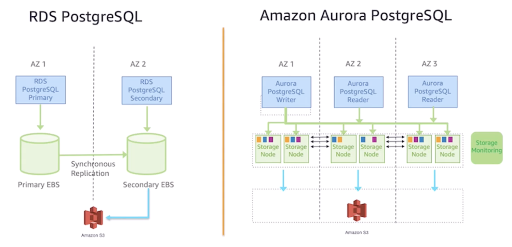

## RDS (Relational Database Service)

Amazon RDS is a service that enables you to run relational databases in the AWS Cloud. The service automates tasks such as hardware provisioning, database setup, patching, and backups. You can integrate RDS with other services to fulfill your business and operational needs, such as AWS Lambda to query your database from a serverless application.

Amazon RDS provides a number of different security options. Many RDS database engines offer **encryption at rest** (protecting data while it is stored) and **in transit** (protecting data while it is being sent and received).

Amazon RDS is available on the following engines:

- Amazon Aurora
- PostgreSQL
- MySQL
- MariaDB
- Oracle Database
- Microsoft SQL Server

### Features

- Routine database operations
- Backup and restore
- Automatically manages DBA task e.g. patching
- High availability and fault tolerance
- Scalability
- Monitoring, audit and performance
- Security
- Blue/green deployment
- Multi-AZ deployments that spans across two AZs with synchronous replication

### Database instances

Amazon RDS is built from compute (EC2 instance) and storage. A DB instance can contain multiple databases with the same engine, and each DB can contain multiple tables.

Underneath the DB instance is an EC2 instance. However, this instance is managed through the Amazon RDS console instead of the Amazon EC2 console.

### Storage

The storage portion of DB instances uses Amazon EBS volumes for database and log storage.

### Read replicas

Replication is performed asynchronously for read replicas. You can scale the read workload of your DB by creating replicas (maximum of 15 replicas). However, **write is only performed to the main DB**.

For multiple Availability Zones, you can create a **failover DB** in case of an outage. It is only active if the failover is triggered.

### Security

RDS can be integrated with IAM and hence, it is recommended that applications get IAM roles, not DB credentials.

Amazon RDS for PostgreSQL, Oracle and MSSQL support both native and Kerberos authentication.

RDS can use Secrets Manager with auto-rotation for managing database passwords; however there are limits.

As RDS is built on top of EC2, the security knobs that you can turn for RDS are similar to EC2 instances e.g. security groups, subnets isolation, VPC isolation, NACLs, etc.

RDS for MSSQL and Oracle supports **Transparent Data Encryption (TDE)** for encryption at rest.

### Monitoring

RDS has RDS **Performance Insights** for more details into slow queries and query times for SQL systems.

You can enable **enhanced monitoring** to collect and analyze operating system-level metrics with granularity up to one second.

You can use the **RDS console** to view and download the database logs directly.

For events, you can use RDS **Event Subscriptions** to subscribe to specific **RDS events** and send notifications to an SNS topic.

### Events

RDS generates events that you can subscribe to:

- DB cluster events
- DB instance events
- DB snapshot events
- DB security group events

To capture data-modifying events (INSERT, DELETE, UPDATE), it can be achieved through native functions or **stored procedures**.

## RDS Proxy

RDS Proxy is a fully managed database proxy for RDS instances that make your application more scalable and resilient i.e. it proxies database connections in front of databases as needed. It establishes a pool of database connections and reuses it if a query is performed.

By offloading query caching from the database, RDS Proxy can reduce database load and improve query response times, contributing to more stable overall performance.

RDS Proxy avoids the problem of oversubscribing and creating too many connections leading to higher memory and CPU utilization. Failover times can be reduced because the proxy automatically reconnects to a new database instance in the case of a failure.

RDS Proxy has **advanced logging**, but it can slow down performance and is automatically turned off after 24 hours.

When RDS Proxy is used, there will be both readonly and readwrite endpoints.

## Amazon Aurora

Amazon Aurora is an enterprise-class relational database. It is compatible with MySQL and PostgreSQL relational databases. It is up to **five times faster than standard MySQL databases** and up to **three times faster than standard PostgreSQL databases**.

Amazon Aurora helps to reduce your database costs by reducing unnecessary I/O operations, while ensuring that your database resources remain reliable and available.

Consider Amazon Aurora if your workloads require **high availability**. It replicates **six copies of your data across three Availability Zones**, and continuously backs up your data to Amazon S3.

### Features

- Purpose-built log structured distributed storage
- Storage volume is striped across storage nodes and multiple AZs
- Storage nodes with locally attached SSDs
- Continuous backup to Amazon S3
- Automatic scaling of storage without any management overhead or downtime
- Allows you to create up to 15 Aurora replicas across 3 AZs
- Offers fast database cloning for staging/development purposes without impacting the performance of the production database
- Asynchronous replication allowing for cross-region replicas that can be promoted in case of regional outages

### Provisioned vs Serverless

Provisioned has fixed capacity, useful for planned capacity, and has access to Aurora Global.

Serverless provides on-demand scaling, useful for variable/unpredictable workloads, and has access to Aurora Global.

You can configure **Aurora Capacity Units (ACUs)** to define the scaling range that the Aurora Serverless cluster can use to automatically scale the database capacity with workload changes. ACU is the unit of measure which equates to 2GB of memory, corresponding CPU, and networking.

### Global cluster

When you use Aurora Global database clusters, it acts as a container for several database clusters each located in different Regions. With global database, the secondary region can be used as a failover for service degradation in the primary region.

A global database cluster comprises of:

- Primary database cluster that accepts read/writes
- Secondary clusters as read only

### Monitoring

Aurora supports CloudWatch, CloudTrail, Enhanced Monitoring and Performance Insights similarly with RDS. However, it also supports **Database Activity Streams**, which provides real-time stream of all the actions in RDS for audit and compliance.
