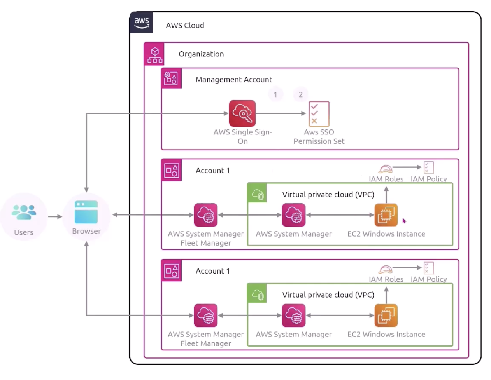

## AWS CloudFormation (Infrastructure-as-a-Service)

AWS CloudFormation is a declarative way of outlining your AWS infrastructure through a **template (JSON/YAML)** i.e. treating **infrastructure as code**. This means that you can build an environment by writing lines of code instead of using the AWS Management Console to individually provision resources.

Each resource within the stack is tagged with an identifier so you can easily see how much a stack costs you. You can also estimate the cost of your resources using the CloudFormation template. When designing, you can see the **relations between the components**.

AWS CloudFormation provisions your resources in a safe and **repeatable manner**, enabling you to frequently build your infrastructure and applications without having to perform manual actions ie. rebuilding architecture across different Regions, accounts, etc. It determines the right operations to perform when managing your stack and rolls back changes automatically if it detects errors.

### Features

- Infrastructure as Code (IAC)
- Consistent and repeatable deployments
- Version control
- Resource tracking
- Cost and efficiency

## AWS Cloud Development Kit (CDK)

CDK allows you to define your cloud infrastructure using a programming language instead of YAML i.e. JS, Python, Java, etc. The code is compiled into a CloudFormation template (JSON/YAML).

```
CodeCommit -> Trigger CodePipeline -> Trigger CDK -> Generate CloudFormation Templates -> Deployment as stack
```

### Features

- Declarative approach
- Component reusability
- AWS construct library
- Automated synthesis
- Environment agnosticism

## AWS Elastic Beanstalk (Platform-as-a-Service)

Helps to scale and deploy web applications made with several programming languages. AWS Elastic Beanstalk handles the deployment of the code as soon as it is uploaded. Beanstalk is free but you have to pay for the underlying resources. **All resources are created by CloudFormation** behind the scenes.

With AWS Elastic Beanstalk, you **only provide code and configuration settings**, and EBS deploys the resources necessary to perform the following tasks:

- Instance configuration
- Deployment strategy
- Managed platform updates
- Load balancing and auto-scaling
- Application health monitoring (health agent pushes metrics to CloudWatch)

## AWS CodeDeploy

CodeDeploy is a hybrid service (EC2, on-premise) that deploys your application automatically. Servers must be provisioned and configured ahead of time with the CodeDeploy agent.

CodeDeploy allows you to upgrade your EC2 instances, applications, and your on-premise server applications from version 1 to version 2.

## AWS Systems Manager (SSM)

SSM helps you to manage your EC2 and on-premise systems at scale (hybrid). It allows you to get operational insights about the state of your infrastructure. Most important features include:

- Patching automation for enhanced compliance (OS and applications)
- Running commands across an entire fleet of servers
- Storing parameter configuration with the SSM Parameter Store

The SSM agent needs to be installed on the systems we want to control.



### Application management

- Application Manager: Group applications and troubleshoot issues
- Parameter Store: Store secrets and data for resources to access (ease for password rotation)

### Change management

- Change Manager
- Automation
- Change Calendar
- Maintenance Windows

### Node management

- Compliance
- Inventory
- Session Manager
- Run Command
- State Manager
- Patch Manager
- Distributor

### Operations management

- Incident Manager
- OpsCenter

### Features

- Centralized control
- Resource grouping
- Automate common and repetitive IT operations and management tasks
- Patching management
- Operational insights
- Secret and configuration management
- Remote management
- Compliance enforcement
- Hybrid capabilities

### SSM Session Manager

Allows you to start a secure shell on your EC2 and on-premise servers. You do not need to provide SSH access, bastion hosts, or SSH keys for your compute instances (enhanced security). You need to attach an IAM role to the EC2 instance to allow it to talk to the SSM service.

Sends session log data to S3 or CloudWatch logs.

## AWS OpsWorks

Chef and Puppet (external software) help you to perform server configuration automatically or repetitive actions. They integrate with EC2 and on-premise VM. OpsWorks was created to give you a managed Chef and Puppet in the cloud (alternative to SSM). However, it allows you to **only provision standard AWS resources**.

## AWS App Runner

AWS App Runner is a fully managed application service that lets you build, deploy, and run web applications and API services without prior infrastructure or container experience.

AWS App Runner builds and deploys web applications automatically, load balances traffic with encryption, scales to meet your traffic needs, and allows for the configuration of how services are accessed and communicate with other AWS applications in a private Amazon VPC.

You can either push code to ECR or git repository.

```
Developer -> push to ECR -> Deploy on App Runner
```

```
Developer -> push to git -> trigger AWS CodeBuild to run tests and push to ECR -> Deploy on AWS Runner
```

To securely access AWS services in private VPCs, you can use a **VPC connector**.

### Features

- Manages infrastructure
- Creates CI/CD pipeline automatically
- Automatically deployment
- Scalability
- Cost-effective

## Serverless Application Model (SAM)

SAM helps to simplify developer's experience in getting out the infrastructure and deployed on AWS Lambda. SAM template is a configuration file that you need to define. Comes with CLI tool.

## Serverless Application Repository (SAR)

Other people can search and discover serverless applications in the repository.

```
Select from SAR -> Create CloudFormation templates from SAM templates -> Deploy resources e.g. API Gateway, Lambda
```

### Features

- Integrated with AWS SAM
- Centralized repository
- Rapid deployment
- Reusable applications
- Public and private sharing

## AWS Amplify

A complete solution for building serverless web and mobile applications. Abstracts AWS services to simplify the process of deploying the applications. On the other hand, AppRunner runs containerized services.

### Features

- Rapid deployment
- Fullstack deployment e.g. authentication, API, storage, hosting, analytics
- Amplify Studio is a visual development environment that integrates with Amplify CLI to manage backend services using graphical interface
- Has pre-built React components for frontend usage
- Support multiple platforms
- Encrypts all data at-rest and in-transit automatically

## AWS Launch Wizard

A service that simplifies the process of deploying well-known third party applications e.g. SQL Server, AD, SAP.

### How it works

1. Choose an application to deploy
2. Enter application specifications
3. Resource recommendation and cost estimate
4. Approval and resource provisioning
5. Configuration and template creation
6. Deployment and integration

### Features

- Simplified application deployment
- AWS resource selection
- Cost estimation
- Time-saving with repeatable code templates
- Cost-effectiveness

## AWS Service Catalog

Users that are new to AWS have too many options, and may create stacks that are not compliant with the rest of the organization. Service Catalog provides a quick self-service portal to launch a set of authorized products pre-defined by admins i.e. admins will curate and configure the services in the catalog. Users are given access to services based on their rules.

CloudFormation templates are used to deploy all the resources i.e. each product in the catalog is a CloudFormation template. IAM policies are used to determine who has access to specific products within a catalog.

You can group products together in portfolios, and give users access to portfolios.

### Why use Service Catalog?

- Consistent deployments
- Governance and compliance
- Controlled spending

## AWS License Manager

A service that helps you manage software licenses across verious vendors including Microsoft, SAP, Oracle, etc.

### Features

- Centralized license management
- License tracking
- Enforce licensing rules
- Cross-account management
- Discovery and reporting

## AWS Proton

AWS Proton is a deployment workflow tool for modern applications that helps platform and DevOps engineers achieve organizational agility. It helps to standardize the application stack and create a consistent environment across all deployments and services.

### Platform

1. Create Environment Templates that define shared resources using IaC
2. Deploy the environments
3. Create Service Templates that define the infrastructure, monitoring and CI/CD resources

### Developers

1. Choose a Service Template and link a source code package
2. Deploy a service that consists of service instances running the source code package as defined in the Service Template

### Benefits

- Automated deployments with CI/CD pipeline
- Flexible definitions
- Proton service components
- Multi-account support
- Template management

## AWS Resource Group and Tag Manager

Resource groups allow you to group resources based off of a specific tag. You can create a custom console that organizes and consolidates resources based off of specific tags. you get a **single view** to manage all of your resources matching the tag i.e. dev/prod environments, applications, departments, etc.

## AWS Resilience Hub

Helps you to setup your disaster recovery process, particularly in the context of AWS cloud environments. It provides a centralized console to manage and automate resilient activities including backup schedules, setting recovery point objectives, etc.

### Terms

- **Recovery Point Objective (RPO)**: Maximum tolerable period in which data might be lost due to a major incident
- **Recovery Time Objective (RTO)**: Targeted duration of time within which a business process must be restored in order to avoid unacceptable consequences

### Features

- Centralized resiliency planning
- Continuous tracking
- Alert during outage
- Automated backups and recovery
- Compliance and reporting

## AWS Resource Explorer

Simplifies the search and discovery of your AWS resources, across Regions using tags or other metadata.

A collection of information about AWS resources in a specific Region is called an **index**. There are two types of indexes:

- Local: Specific to a Region (replicate over to the Region with aggregate index)
- Aggregate: Collected data across all Regions

Responsibilities are as follows:

- Admin: Turning on Resource Explorer, updating index types, creating views, granting search permissions
- User: Search for resources
