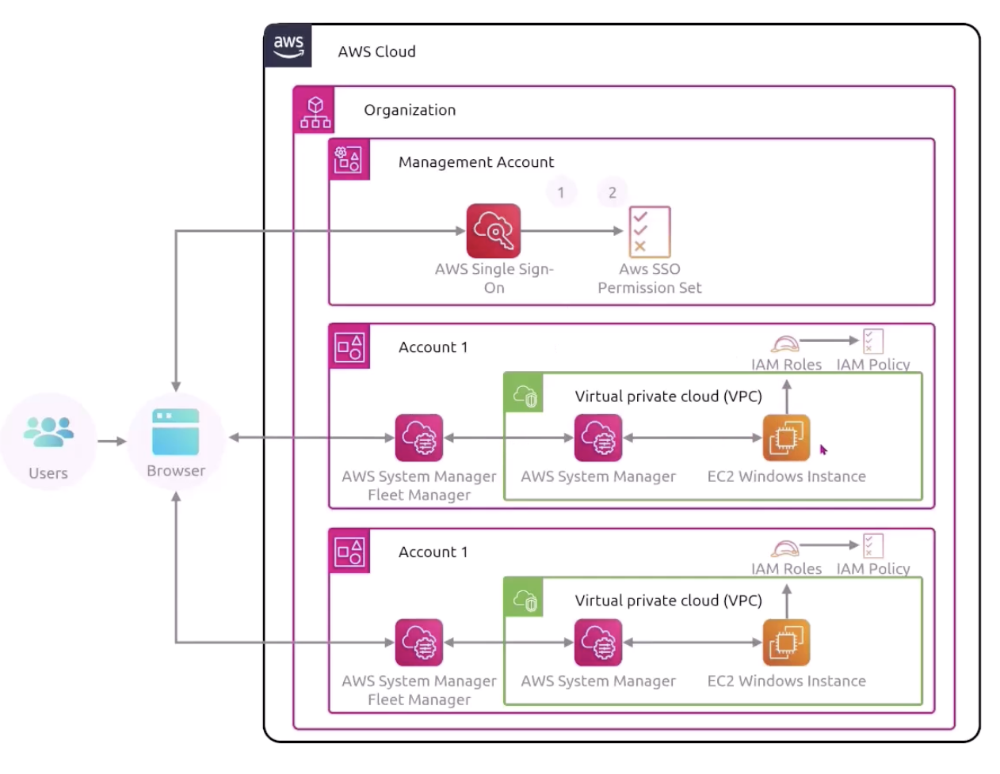

## AWS Systems Manager (SSM)

SSM helps you to manage your EC2 and on-premise systems at scale (hybrid). It allows you to get operational insights about the state of your infrastructure. Most important features include:

- Patching automation for enhanced compliance (OS and applications)
- Running commands across an entire fleet of servers
- Storing parameter configuration with the SSM Parameter Store

The SSM agent needs to be installed on the systems we want to control.

### Application management

- Application Manager: Group applications and troubleshoot issues
- Parameter Store: Store secrets and data for resources to access (ease for password rotation)
- AppConfig: Manage, validate and deploy application configurations

### Change management

- Change Manager: A flow tool that automates and govern IT changes
- Automation: Streamline and automate repetitive tasks such as patching, restarting servers
- Change Calendar
- Maintenance Windows

### Node management

- Compliance: Access and report on node compliance
- Inventory: Collect and view software inventory
- Session Manager
- Run Command: Executing tasks across multiple instances e.g. running scripts, applying patches, updating applications
- State Manager
- Patch Manager
- Distributor: Distributing and installing software packages to fleet of servers

### Operations management

- Incident Manager
- OpsCenter: Centralize operational issue tracking and resolution, providing a unified view of incidents across AWS and hybrid environments

### Features

- Centralized control
- Resource grouping
- Automate common and repetitive IT operations and management tasks
- Patching management
- Operational insights
- Secret and configuration management
- Remote management
- Compliance enforcement
- Hybrid capabilities

### SSM Session Manager

Allows you to start a secure shell on your EC2 and on-premise servers. You do not need to provide SSH access, bastion hosts, or SSH keys for your compute instances (enhanced security). You need to attach an IAM role to the EC2 instance to allow it to talk to the SSM service.

Sends session log data to S3 or CloudWatch logs.

## AWS OpsWorks

Chef and Puppet (external software) help you to perform server configuration automatically or repetitive actions. They integrate with EC2 and on-premise VM. OpsWorks was created to give you a managed Chef and Puppet in the cloud (alternative to SSM). However, it allows you to **only provision standard AWS resources**.

## AWS Resource Group and Tag Manager

Resource groups allow you to group resources based off of a specific tag. You can create a custom console that organizes and consolidates resources based off of specific tags. you get a **single view** to manage all of your resources matching the tag i.e. dev/prod environments, applications, departments, etc.

## AWS Resource Explorer

Simplifies the search and discovery of your AWS resources, across Regions using tags or other metadata.

A collection of information about AWS resources in a specific Region is called an **index**. There are two types of indexes:

- Local: Specific to a Region (replicate over to the Region with aggregate index)
- Aggregate: Collected data across all Regions

Responsibilities are as follows:

- Admin: Turning on Resource Explorer, updating index types, creating views, granting search permissions
- User: Search for resources
