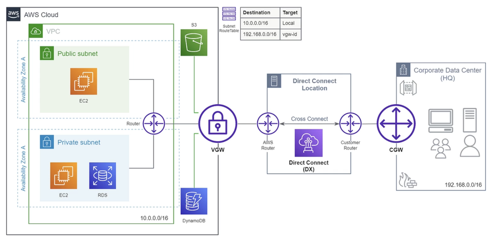

## Virtual Private Network (VPN)

By default, instances that you launch into an Amazon VPC can't communicate with your own (remote) network. You can enable access to your remote network from your VPC by creating an AWS Site-to-Site VPN connection, and configuring routing to pass traffic through the connection.

A virtual private gateway enables you to establish a virtual private network (VPN) connection between your VPC and a private network, such as an on-premise data center or internal corporate network. **It allows traffic into the VPC only if it is coming from an approved network**. However, it goes over the public internet (encrypted) and may have limited bandwidth, but relatively fast to setup.

There are two types of VPN:

- Site-to-Site VPN: VPN over public internet between on-premises DC and AWS
- ClientVPN: OpenVPN connection from your computer into your VPC

### Virtual Private Gateway (VPG)

A VPG connects your VPC to another private network i.e. it is the component that allows protected internet traffic to enter into the VPC. However, it still uses the same traffic as public users.

### VPN tunnel

An encrypted link where data can pass from the customer network to or from AWS.

### How it works

- The VPG is attached to the VPC (terminates VPN on the AWS side)
- A customer gateway to the other private network is required on the other side (terminates VPN on the customer side)
- A customer gateway device is a physical device or software application
- When you have both gateways, you can then establish an encrypted virtual private network (VPN)

### Routing

You can configure statically by defining routes in the routing table. Alternatively, you can configure a dynamic routing protocol to exchange routes between VPG and CG using BGP.

### Pricing

Charged for:

- Each available VPN connection per hour
- Data transfer out from EC2 to the internet

## Site-to-Site VPN

### Tunnel options

Each Site-to-Site VPN connection has two tunnels, with each tunnel using a unique public IP address. It is important to **configure both tunnels for redundancy**. When one tunnel becomes unavailable (for example, down for maintenance), network traffic is automatically routed to the available tunnel for that specific Site-to-Site VPN connection.

## AWS VPN CloudHub

You can securely communicate from one site to another using the AWS VPN CloudHub. The AWS VPN CloudHub operates on a simple hub-and-spoke model that you can use with or without a VPC. Use this approach if you have multiple branch offices and existing internet connections and would like to implement a convenient, potentially low-cost hub-and-spoke model for primary or backup connectivity between these remote offices.

## VPC Peering

VPC Peering is used to connect two VPCs privately using AWS network. With VPC Peering, you can setup a connection between VPCs in different Regions and AWS accounts. This method is preferred over transit gateway if a **simpler method** is required.

To setup routing, need to configure routing table in each VPC to the VPC Peering target.

VPC Peering:

- **Must not have overlapping CIDR**
- VPC Peering connection is **not transitive** (must be established for each VPC that needs to communicate with one another, does not inherit existing peerings)

### Pricing

- No cost for VPC peering connection creation
- Data transfer within an AV is free
- Data transfer across AV incurs charges

## Transit Gateway

A single gateway to provide transitive peering between thousands of VPC and on-premises, through hub-and-spoke (star) connection.

You need to specify **one subnet from each AZ** to be used by the Transit Gateway to route traffic. Transit Gateway can also establish peering with other Transit Gateways in different Regions and AWS accounts.

## AWS Direct Connect (DX)

AWS Direct Connect is a service that lets you to establish a dedicated **physical** private connection between your **data center** and a VPC which allows for high speed. As a different traffic is used as compared to public users, it helps you to reduce network costs and increase the amount of bandwidth that can travel through your network. However, it takes at least a month to establish.

For secure connection, you can implement a VPN over Direct Connect to add an additional layer of network security for data in transit.

### How it works

Cross connect is a connection between a port on AWS router and customer router in the DX location.

```
On-premise network -> Customer Gateway -> Customer Router (located in DX) -> AWS Router -> VPN Gateway -> VPC
```



### Pricing

- Port hours
- Outbound data transfer
