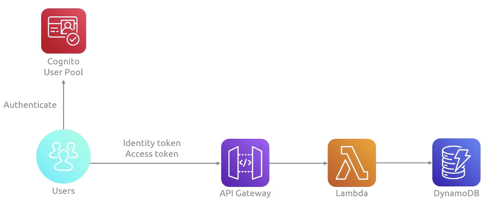
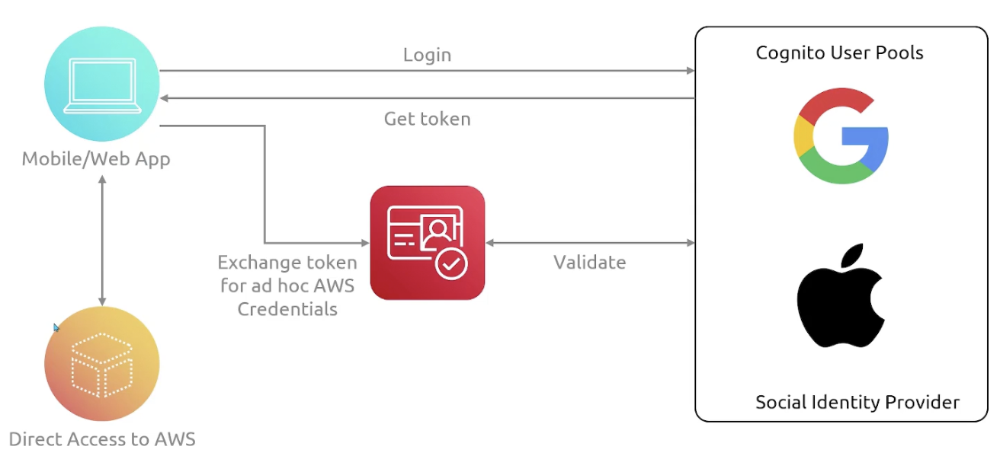

## AWS CloudTrail

AWS CloudTrail provides **governance, compliance and audit** for your AWS account by recording API calls made within your AWS account i.e. trail of breadcrumbs or log of actions that someone has left behind them. **You can use API calls to provision, manage and configure your AWS resources**.

The API calls made within your AWS accounts can come from:

- Console
- SDK
- CLI

The recorded information includes (non-exhaustive):

- Identity of the API caller
- Time of the API call
- Source IP address

Events are typically updated in CloudTrail within 15 minutes after an API call. You can also filter events by specifying your criteria. You can put logs from CloudTrail into CloudWatch Logs or S3 for longer term retention.

### CloudTrail Insights

This optional feature allows CloudTrail to automatically detect unusual API activities in your AWS account.

## AWS Artifact

AWS Artifact is a service that provides on-demand access to AWS security and compliance reports and select online agreements for audit purposes.

### Artifact Agreements

You can use AWS Artifact Agreements if your company needs to sign an agreement with AWS regarding your use of certain types of information throughout AWS services.

### Artifact Reports

AWS Artifact Reports provide compliance reports from third-party auditors. You can provide them to your auditors or regulators as evidence of AWS security controls.

## Customer Compliance Center

The Customer Compliance Center contains resources to help you learn more about AWS compliance. You can read compliance stories to discover how companies in regulated industries have solved various compliance, governance, and audit challenges.

## AWS Shield

AWS Shield is a service that protects applications against DDoS attacks.

### Standard

Automatically protects all AWS customers at no cost. It protects your AWS resources from the most common, frequently occurring types of DDoS attacks.

As network traffic comes into your applications, AWS Shield Standard uses a variety of analysis techniques to detect malicious traffic in real time and automatically mitigates it.

Provides expanded DDoS attack protection for web applications running on EC2, ELB, CloudFront, Route 53, and AWS Global Accelerator.

### Advanced

A paid service that provides detailed attack diagnostics and the ability to detect and mitigate sophisticated DDoS attacks, and with **24/7 support**.

It also integrates with other services such as Amazon CloudFront, Amazon Route 53, and Elastic Load Balancing.

## AWS Key Management Service (KMS)

You must ensure that your applications' data is secure while in storage (**encryption at rest**) and while it is transmitted (**encryption in transit**).

Encryption is always enabled by default for AWS CloudTrail Logs, AWS Storage Gateway and S3. For other services (EBS, EFS, RDS), encryption is an optional feature that must be enabled by the user.

KMS is a service that helps you manage your encryption keys for AWS services and applications. Handles the heavy lifting including creating, deleting, rotating keys, signing, encrypting.

AWS KMS enables you to perform encryption operations through the use of cryptographic keys. You can use AWS KMS to create, manage and use cryptographic keys. Your keys never leave KMS, and you are always in control of them.

Types of Master Keys:

- **Customer managed CMK**: Created by the customer, have full control
- **AWS managed CMK**: Used by AWS services, no costs associated
- **AWS owned CMK**: Used to protect resources in your account
- **CloudHSM Keys**: Keys generated from your own CloudHSM hardware device

## AWS CloudHSM (Hardware Security Module)

With CloudHSM, all your keys are stored on one hardware device, and it will be responsible for encrypting and decrypting your files. All keys are securely stored on the HSM and they never leave the device. It does a more secure, single-tenancy, hardware-based cryptography.

With CloudHSM, you manage the keys and they are not available to AWS, although AWS manages the module.

CloudHSM allows deploying HSM clusters across AZs with automatic failover to provide high availability and fault tolerance.

### Features

- Dedicated hardware security with keys isolated and accessible by you only
- Full control over keys
- Scalability and resilience
- Integrates with AWS services
- Regulatory compliance

## AWS Web Application Firewall (WAF)

AWS WAF is a web application firewall that lets you monitor network requests that come into your web applications. Functions at Layer 7 (HTTP/HTTPS).

### Web ACLs

AWS WAF works together with Amazon CloudFront and ALB. It works in a similar way as network ACLs by using a **web ACL** to protect your AWS resources i.e. by restricting IP addresses, HTTP body, HTTP headers, SQL injection, XSS, etc.

Charges are based on the number of web ACLs you create, and the number of rules that you add per web ACL, and the number of web requests you receive.

### Rate-based rules

- Blanket: Prevents source IP address from making excessive requests to entire application
- URI-specific
- IP reputation

### Use cases

- Protection against common web attacks
- API security
- Protection for serverless applications
- Application layer firewall

## AWS Firewall Manager

Firewall manager simplifies the process of managing all of your WAF rules, security groups, NACLs, and AWS Shield, across **multiple accounts** for consistency.

## Amazon Inspector

Amazon Inspector helps to improve the security and compliance of applications by running **automated security assessments**. It checks applications for security vulnerabilities and deviations from security best practices, such as open access to EC2 instances and installations of vulnerable software versions.

After assessment, it provides you with a list of security findings with a risk score for prioritization. However, AWS does not guarantee that following provided recommendations resolves every potential security issue.

### Vulnerabilities

- Package
- Code
- Network

## Amazon GuardDuty

Amazon GuardDuty is a service that provides intelligent threat detection for your AWS infrastructure and resources. It identifies threats by continuously monitoring the network security and account behavior within your AWS environment by analyzing data from multiple AWS sources including:

- VPC Flow Logs
- CloudTrail Events Logs
- DNS Logs

If an anomaly is detected, an event can be created in EventBridge to trigger automation including SNS or Lambda functions. GuardDuty can protect against cryptocurrency attacks (has a dedicated 'finding').

## Amazon Macie

Amazon Macie is a fully managed data security and data privacy service that uses machine learning and pattern matching to discover and protect your sensitive data in S3 buckets. Macie helps identify and alert you to sensitive data, such as **personally identifiable information (PII)** e.g. name, age, DOB, email, contact.

## AWS Secrets Manager

AWS Secrets Manager helps you manage, retrieve, and automatically rotate database credentials, API keys, and other secrets throughout their lifecycles. Secrets are encrypted using KMS.

Secrets Manager helps you improve your security posture, because you no longer need hard-coded credentials in application source code. Storing the credentials in Secrets Manager helps avoid possible compromise by anyone who can inspect your application or the components. You replace hard-coded credentials with a runtime call to the Secrets Manager service to retrieve credentials dynamically when you need them.

### Secret rotation

- Managed: Updating credentials in the database
- Lambda: For other types of secrets e.g. API keys

## Penetration Testing

You can perform penetration testing on your AWS infrastructure. However, prohibited activities include:

- DNS zone walking
- DoS, DDoS, Simulated DoS, Simulated DDoS
- Port flooding
- Protocol flooding
- Request flooding

## AWS Certificate Manager (ACM)

Allows you to easily provision, manage and deploy SSL/TLS certificates. Supports both public (free) and private TLS certificates.

### Features

- Automated certificate provisioning
- Auto-renewal
- Seamless deployment
- Central management

## AWS Private Certificate Authority (PCA)

Certificates generated from PCA can only be trusted and used from within the organization i.e. internal. Integrates with AWS ACM.

## AWS Config

Helps with auditing and compliance of your AWS resources by recording configurations and changes over time. Logs are stored in S3 bucket.

You can setup **Config Rules** to confirm that resources are configured in compliance with policies that you define. When AWS Config detects that a resource violates the conditions in one of your rules, AWS Config flags the resource as non-compliant and sends a notification. For instance:

- Checking for approved AMI images
- Required-Tag to check if a resource contains the tags that you specify
- Evaluate whether your AWS resources comply with common best practices e.g. check if EBS is encrypted, password is compliant with company policy, etc.

### Features

- Keeps inventory of AWS resources
- Continuously monitors and records AWS resource configurations
- Detects and captures changes to AWS resources over time
- Reports on non-compliant resources adn takes corrective actions
- Sends notification when resource configuration changes

## AWS Security Hub

Central security tool to manage security across several AWS accounts and automate security checks. Aggregates alerts and findings from various AWS services into a consolidated dashboard:

- Config
- GuardDuty
- Inspector
- Macie
- IAM Access Analyzer
- CloudWatch
- External security tools

## Amazon Detective

Amazon Detective analyzes, investigates, and quickly identifies the root cause of security issues or suspicious activities using ML and graphs. Automatically collects and processes events from:

- VPC Flow Logs
- CloudTrail
- GuardDuty

## AWS Abuse

Service used to report AWS resources suspected of using abusive or illegal purposes including:

- Spam
- Port scanning (sending packets to your ports to discover unsecured ones)
- DDoS
- Intrusion attempts (logging into your resources)
- Hosting copyrighted content
- Distributing malware

## IAM Access Analyzer

Service used to find out which resources are shared externally including:

- S3 Buckets
- IAM Roles
- KMS Keys
- Lambda functions
- Secrets Manager Secrets

Need to define Zone of Trust, and any access outside will be flagged as findings.

## AWS Security Token Service (STS)

STS enables you to create temporary, limited-privileges credentials to access your AWS resources.

## Amazon Cognito

Provides identity for your web and mobile application users. Instead of creating an IAM user, you create a user in Cognito i.e. authentication at the application level.

### User pools

### Identity pools

Temporary AWS credentials.

`

### Features

- Complete solution for user authentication
- Storage of usernames and passwords
- Session management
- Forgotten password functionality
- Easy to implement social logins
- Integration with Identity Providers

## AWS Directory Service

Directory Service is used for AD integration. You can create a trust relationship between Directory Service and IAM to allow Directory users assume an IAM role.

### Modes

- **Simple**: Designed to run in isolation, does not integrate with others
- **Managed Microsoft AD**: Allows trust relationship to be established between cloud and on-premise directories
- **AD Connector**: Acts as a proxy to on-premise environment if have existing AD

## AWS Verified Permissions

Amazon Verified Permissions is a scalable, fine-grained permissions management and authorization service for custom applications built by you. Helps developers build secure applications quickly by centralizing policy management. Operates on **zero trust principle**.

Verified Permissions helps you implement and enforce fine-grained authorization on resources within the applications that you build and deploy, such as HR systems and banking applications. With Verified Permissions, you can perform the following tasks:

1. Define a policy-based access model that describes the resources managed by your application and the actions (such as view, update, and share) that users can perform on those resources
2. Provide application users with the ability to manage access to those resources
3. Enforce those permissions

Verified Permissions is about creating policy validation, testing, and access via **Cedar policy language**.

Use Verified Permissions along with your identity provider, such as Amazon Cognito, for a more dynamic, policy-based access management solution for your applications:

- Application developers can use Amazon Cognito to manage user identities and authenticate users at sign-in
- Verified Permissions can then determine which application resources an authenticated user is permitted to access (authorization)

### Features

- Utilizes Cedar policy language for detailed permissions
- Pricing based on the number of authorization requests per month
- Security and audit teams can better analyze and audit access within applications
- Can be accessed using Management Console, CLI or SDK

## AWS Security Lake

Collects logs and events from multiple sources and manages them in a centralized location. Logs are stored in S3 bucket.

### Features

- Data aggregation
- Variety of supported log and event sources
- Data transformation and normalization
- Multi-account and multi-region data management
- Data lifecycle management and optimization
