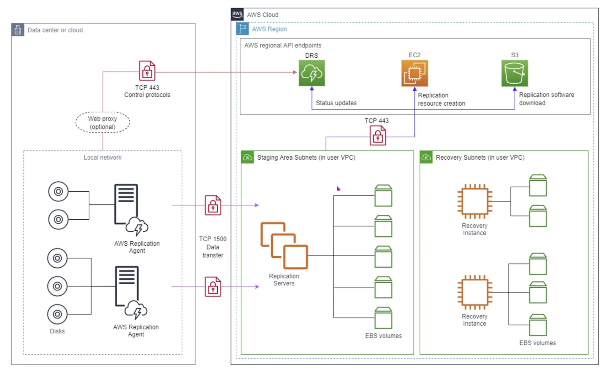

## AWS Backup

**Backup** creates copies of data to restore it in case of data loss. It is an essential part of disaster recovery. **Disaster recovery** encompasses a broader strategy, and includes planning for system and application recovery e.g. EBS Snapshots, S3. A solid disaster recovery plan ensures business continuity, minimizes downtime, and safeguards data integrity.

With AWS Backup:

- you have a single, unified console for managing AWS services
- Automates backup scheduling and retention policies
- Backup resources in different Regions and different accounts
- Can perform backups across a wide variety of services e.g. EC2, EBS, EFS, RDS, etc.

### Components

- Backup vault
- Backup plan i.e. frequency
- Recovery point e.g. checkpoint

### Locks

- Vault lock: Prevents deletion on data in a single vault (has compliance and governance mode)
- Legal hold: Locks resources across all backups

## Elastic Diaster Recovery (DRS)

### Features

- Fully managed disaster recovery service for physical, virtual and cloud-based servers
- Customers can use AWS as a recovery site instead of investing in on-premises disaster recovery infrastructure
- Keeps things in a continual replication state
- Easy to access with a diaster recovery infrastructure
- Failover from on-premise/other cloud platforms/AWS Regions to AWS

### Components

- Source servers: Represent the servers/data that you want to replicate (AWS Replication Agent is installed on the source servers)
- Staging area: Location AWS will receive the replicated data
- Launch template: Used to configure the specifications of the recovery servers e.g. size, region/subnet, security group, etc.
- Recovery servers: Servers that you failover to during disasters
