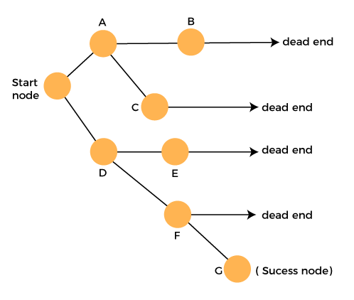

## Backtracking

A general algorithm for solving constraint satisfaction problems. Uses a brute force approach for finding the desired output. The term backtracking suggests that if the current solution is not suitable, then backtrack and try other solutions. Hence, recursion is used in this approach. Can be used to solve N-queen problem, knight tour problem, sudoku problem, maze solving problems, and search for all Hamilton paths in a graph.

As the problem will have constraints, solutions that do not meet them will be reset/removed. In constrast with dynamic programming, backtracking is used when there are multiple solutions, and all solutions are required.

Algorithm seeks a path to a feasible solution that includes intermediate checkpoints. If the checkpoints do not lead to a viable solution, the problem can return to the checkpoints and take another path to find a solution.

### Algorithm

```
backtrack(s) {
  if (solution meets constraint)
    update solution
    backtrack(s)
  else
    reset/remove solution
    return false
}
```

### State-Space Tree


