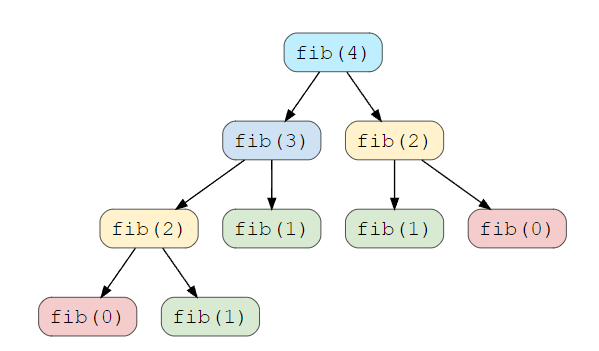

## Dynamic Programming (DP)

DP is mainly an optimization over plain recursion. Whenever we see a recursive solution that has repeated calls for same inputs i.e. overlapping subproblems, it can be optimized with DP.

Similarly to divide-and-conquer, dynamic programming solves problems by breaking it down into simpler subproblems and utilizing the fact that the optimal solution to the overall problem depends upon the optimal solution to its subproblems. Typically applied to optimization problems which can have many possible solutions i.e. finding the solution with min/max value.

Dynamic Programming solves the subproblems before making the first choice. Typically solve dynamic-programming problems in a bottom-up manner, progressing from smaller subproblems to larger subproblems. This only applies when subproblems share subsubproblems. When developing this algorithm, the sequence of steps are as follows:

1. Characterize the structure of an optimal solution.
2. Recursively define the value of an optimal solution.
3. Compute the value of an optimal solution, typically in bottom-up fashion.
4. Construct an optimal solution from computed information.

In order for dynamic programming to apply, two key ingredients that an optimization problem must have are optimal substructure and overlapping subproblems.

### Optimal Substructure

A problem exhibits optimal substructure if an optimal solution to the problem contains within it optimal solutions to subproblems i.e. solutions to subproblems must themselves be optimal.

### Subtleties

Be careful not to assume that optimal substructure exists when it does not. For the below problem finding longest and shortest paths, though both uses two subproblems, the subproblems in finding the longest simple path are not independent, whereas for shorteest paths they are. This means the solution to one subproblem affects the solution to another subproblem.

For instance, finding the longest path from q to t yields two subproblems: finding longest paths from q to r, and r to t. For the first subproblem, path q -> s -> t -> r is chosen; since s and t nodes are used, they cannot be used in second subproblem and hence, the problem cannot be solved at all.


### Shortest Path

Finding the shortest path from U to V is suboptimal i.e. if U to V contains node K, then overall shortest path must contain the shortest path from U to K, and K to V.

### Longest Path

Finding the longest path does not exhibit optimal substructure. If U to V contains node K, and given P1 = U to K, and P2 = K to V, P1 and P2 are actually NOT the longest paths between their given nodes.

## Overlapping Subproblems

Any problem has overlapping subproblems if finding its solution involves solving the same subproblem multiple times i.e. fibonacci sequence. Dynamic programming algorithms take advantage of overlapping subproblems by solving each subproblem once and then storing the solution in a table/array where it can be looked up when needed, using constant time per lookup.

```
fib(n) = fib(n-1) + fib(n-2)

n     Number of times fib() called
2     1
4     5
10    109
15    1219
```



## Top-Down with Memoization

In this approach, we solve the bigger problem by recursively finding the solution to smaller subproblems. When a subproblem is solved, the result is cached so that we don't end up solving it repeatedly if it's called multiple times. A memoized algorithm maintains an entry in a table for the solution to each subproblem.

```
fibMemoized(n) {
  fibResult = [0, 1]

  if n <= 1
    return 1
  else
    i = 2
    while i <= n
      fibResult[i] = fibResult[i-1] + fibResult[i-2];
    return fibResult[n]
}
```

## Bottom-Up Method

Avoids recursion by solving smaller subproblems first. When solving a particular subproblem, we would have already solved all smaller subproblems the solution depends on, and their solutions would have been saved. This approach often has much better constant factors, since it has less overhead for procedure calls.
