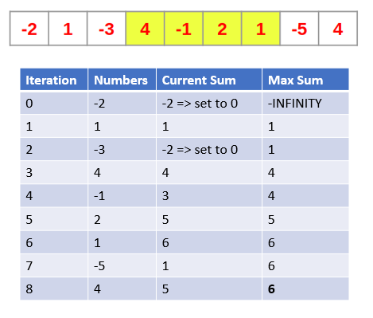

## Kadane

Can be used to solve maximum subarray problem, whereby the task is to find the largest possible sum of a contiguous subarray, within a given one-dimensional array of numbers.

Applies brute force approach but utilizes dynamic programming. Calculates maximum subarray ending at a particular position by using the maximum sum subarray ending at the previous position.

### Approach

1. Define current_sum (initialized to 0) and max_sum (initialized to -INFINITY).
2. If cur_sum > max_sum, update max_sum.
3. If cur_sum is < 0, set it to 0.

### Algorithm

```js
function kadane(arr) {
  let maxSum = -Infinity;
  let curSum = 0;

  for (let i = 0; i < arr.length; i++) {
    curSum += arr[i];

    if (curSum < 0) curSum = 0;
    else {
      if (curSum > maxSum) maxSum = curSum;
    }
  }
  return maxSum;
}
```

### Example


