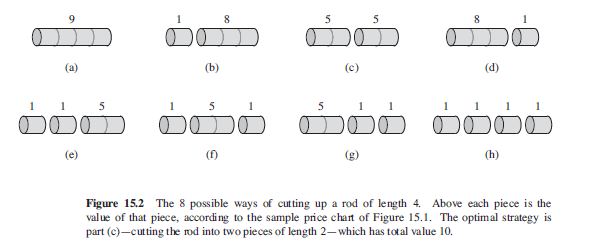
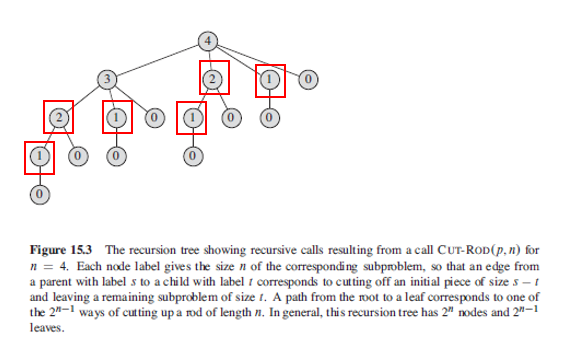

## Rod Cutting

Given a rod of length n inches and a table of prices Pi, determine the maximum revenue obtainable by cutting up the rod and selling the pieces. Can cut up a rod of length n in 2^(n-1) ways as there are n-1 places where we can choose to make cuts, and at each place, we either can make a cut or don't.

If you cut the rod into two, the possible solutions as follows:

1. For each rod, recursively solve each one.
2. One piece to sell whole, and the remainder to be recursively solved.

```
Length  1   2   3   4   5   6   7   8   9   10
Price   1   5   8   9   10  17  17  20  24  30
```

### Example (n = 4)

Since we don't know ahead of time which value of i optimizes revenue, have to consider all possible values of i. Once the first cut is made, we may consider the two pieces as independent instances of the rod-cutting problem i.e. subproblems. The overall optimal solution incorporates optimal solutions to the two related subproblems, maximizing revenue from each of those two pieces.



```
Rn = max(Pn, R1 + Rn-1, R2 + Rn-2, ..., Rn-1 + R1)

R4 = max(
  P4,
  R1 + R3,  // R3 = P3, R1+R2, R2+R1
  R2 + R2,  // R2 = P2, R1+R1
  R3 + R1,  // R3 = P3, R1+R2, R2+R1
)

// P4, R1+P3, R1+R1+R2, R1+R2+R1, R2+R2, R1+R1+R1+R1, P3+R1, R2+R1+R1
```

### Brute-Force Approach

Algorithm is inefficient as it calls itself recursively with the same parameter values i.e. solves the same subproblems repeatedly. For n=4, it is computing the optimal solution for n=1 four times, and n=2 twice. Has time complexity of n^n.



```
// recursive top-down implementation
cutRod(p,n) {
  if n == 0
    return 0
  max = -INFINITY
  for (i=1; i<=n; i++)
    tmp = p[i] + cutRod(p, n-i)
    if (tmp > max)
      max = tmp
  return max
}
```

### Top-Down Memoization

Tradeoff for DP is that it requires additional memory to save computation time. Nonetheless, it can transform an exponential-time solution into a polynomial-time solution. Has time complexity of n^2.

```
// p is an array of prices

memoizedCutRod(p,n){
  r = []
  for i = 0 to n
    r[i] = -INFINITY
  return memoizedCutRodAux(p,n,r)
}

memoizedCutRodAux(p,n,r) {
  if r[n] >= 0
    return r[n]

  if n == 0
    q = 0
  else
    q = -INFINITY
    for i = 1 to n
      q = max(q, p[i], memoizedCutRodAux(p, n-i, r))
  r[n] = q
  return q
}
```

### Bottom-Up Method (Extended)

Extended version includes the the choice leading to optimal value.

```
bottomUpCutRod(p,n) {
  r = []
  s = []
  r[0] = 0
  for j = 1 to n
    q = -INFINITY

    for i = 1 to j
      if q < p[i] + r[j-i]
        q = p[i] + r[j-i]   // r[j-i] assumes subproblem is already solved
        s[j] = i            // the optimal size of the first piece to cut off

    r[j] = q

  return r, s
}
```
