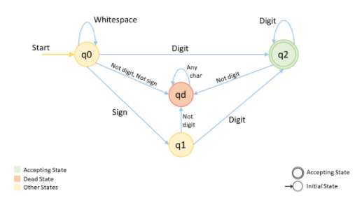

## Deterministic vs Non-Deterministic

Functions can either be deterministic or non-deterministic. A deterministic function always return the same results if given the same input values, while a non-deterministic may return different results every time it is called, with the same inputs provided.

## Non-Deterministic Finite Automata

A Finite Automata is said to be non-deterministic if there is more than one possible transition from one state on the same input.

## Deterministic Finite Automata

DFA are finite state machines that accept or reject string of characters by parsing them through a sequence that is uniquely determined by each string. These machines are finite because there are a limited number of possible states which can be reached. In DFA:

- There is only one path for specific input from current to next state.
- Does not accept null move i.e. DFA cannot change state without any input character.
- Can contain multiple final states.

### Components

Made up of five components (often denoted by five-symbol set called 5-tuple):

- Finite number of states.
- Set of symbols known as the alphabet, also finite in number.
- A function that operates the transition between states for each symbol.
- An initial start state where first input is given or processed.
- A final state or states called "accepting states".

### Process

Given some starting state and each time a character is read:

- Can stay in current state.
- Can transition to new state.
- Can terminate if invalid.

### Example



```js
class StateMachine {
  // Store current state value.
  #currentState;
  // Store result formed and it's sign.
  #result;
  #sign;

  State;
  #INT_MAX;
  #INT_MIN;

  constructor() {
    this.State = { q0: 1, q1: 2, q2: 3, qd: 4 };
    this.#INT_MAX = Math.pow(2, 31) - 1;
    this.#INT_MIN = -Math.pow(2, 31);

    this.#currentState = this.State.q0;
    this.#result = 0;
    this.#sign = 1;
  }

  // Transition to state q1.
  toStateQ1(ch) {
    this.#sign = ch == '-' ? -1 : 1;
    this.#currentState = this.State.q1;
  }

  // Transition to state q2.
  toStateQ2(digit) {
    this.#currentState = this.State.q2;
    this.appendDigit(digit);
  }

  // Transition to dead state qd.
  toStateQd() {
    this.#currentState = this.State.qd;
  }

  // Append digit to result, if out of range return clamped value.
  appendDigit(digit) {
    if (
      this.#result > Math.floor(this.#INT_MAX / 10) ||
      (this.#result == Math.floor(this.#INT_MAX / 10) && digit > this.#INT_MAX % 10)
    ) {
      if (this.#sign == 1) {
        // If sign is 1, clamp result to INT_MAX.
        this.#result = this.#INT_MAX;
      } else {
        // If sign is -1, clamp result to INT_MIN.
        this.#result = this.#INT_MIN;
        this.#sign = 1;
      }

      // When the 32-bit int range is exceeded, a dead state is reached.
      this.toStateQd();
    } else {
      // Append current digit to the result.
      this.#result = this.#result * 10 + digit;
    }
  }

  // Change state based on current input character.
  transition(ch) {
    if (this.#currentState == this.State.q0) {
      // Beginning state of the string (or some whitespaces are skipped).
      if (ch == ' ') {
        // Current character is a whitespaces.
        // We stay in same state.
        return;
      } else if (ch == '-' || ch == '+') {
        // Current character is a sign.
        this.toStateQ1(ch);
      } else if (ch >= '0' && ch <= '9') {
        // Current character is a digit.
        this.toStateQ2(ch - '0');
      } else {
        // Current character is not a space/sign/digit.
        // Reached a dead state.
        this.toStateQd();
      }
    } else if (this.#currentState == this.State.q1 || this.#currentState == this.State.q2) {
      // Previous character was a sign or digit.
      if (ch >= '0' && ch <= '9') {
        // Current character is a digit.
        this.toStateQ2(ch - '0');
      } else {
        // Current character is not a digit.
        // Reached a dead state.
        this.toStateQd();
      }
    }
  }

  // Return the final result formed with it's sign.
  getInteger() {
    return this.#sign * this.#result;
  }

  // Get current state.
  getState() {
    return this.#currentState;
  }
}

var myAtoi = function (s) {
  let Q = new StateMachine();

  for (let i = 0; i < s.length && Q.getState() != Q.State.qd; ++i) {
    Q.transition(s[i]);
  }

  return Q.getInteger();
};
```
