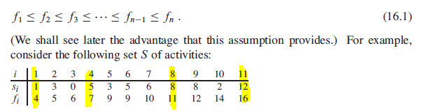
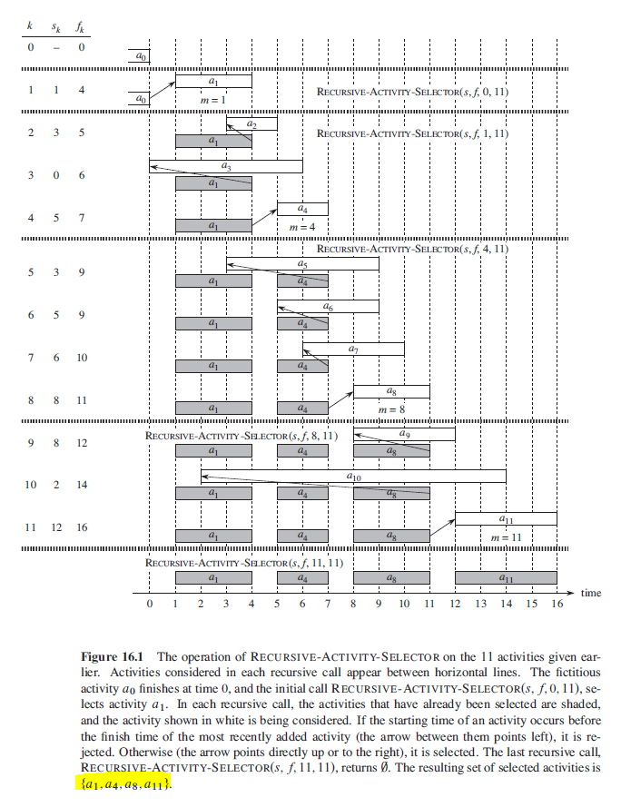

## Activity-Selection Problem

- Given a set S with activities = {a1, a2, ..., an}
- Each activity has start and finish time i.e. Si, Fi
- Objective is to find max-size set of mutually compatible activities.
- ai and aj are compatible if their intervals do not overlap.
- si >= fj or fi <= sj

Assumption: activities are sorted in monotonically increasing order of finish time.



## Making the Greedy Choice (Choosing First Activity to Finish)

Intuition suggests that we should choose an activity that leaves the resource available for as many other activities as possible i.e. choosing the activity with earliest finish time. If more than one activity in S has the earliest finish time, then we can choose any.

Since the activities are sorted in monotonically increasing order of finish time, the first activity would have the earliest finish time. We are left with one remaining subproblem to solve: finding activities that after a1 finishes.

```
// the set of activities that start after activity Ak finishes
let Sk = {Ai be element of Set: Si >= Fk}
```

```
// s is an array of start times
// f is an array of finish times
// k defines the subproblem Sk it is to solve
// n refers to the size of original problem

recursiveActivitySelector(s,f,k,n) {
    m = k + 1
    while m <= n && s[m] < f[k]
        // find the first activity in Sk to finish
        m = m + 1

    if m <= n
        return {Am} union recursiveActivitySelector(s,f,m,n)
    else
        return {selected activities}
}
```

## Algorithm Operation

### Step 1

recursiveActivitySelector(s,f,0,11) with fictious activity A0 with f[0] = 0. Function is called recursively.

Activities selected: {A1}

### Step 2

recursiveActivitySelector(s,f,1,11). s[2] and s[3] have start times < f[1]. While loop ends with m = 4. Function is called recursively.

Activities selected: {A1, A4}

### Step 3

recursiveActivitySelector(s,f,4,11). While loop ends with m = 8. Function is called recursively.

Activities selected: {A1, A4, A8}

### Step 4

recursiveActivitySelector(s,f,8,11). While llop ends with m = 11. Function terminates.

Activities selected: {A1, A4, A8, A11}

### Figure



## Iterative Greedy Algorithm

```
greedyActivitySelector(s,f){
    n = s.length
    A = {A1}
    k = 1
    for m = 2 to n
        if s[m] >= f[k]
        A = A union {Am}
        k = m
    return A
}
```
