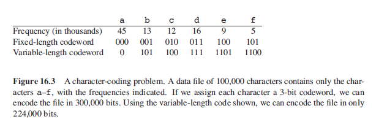
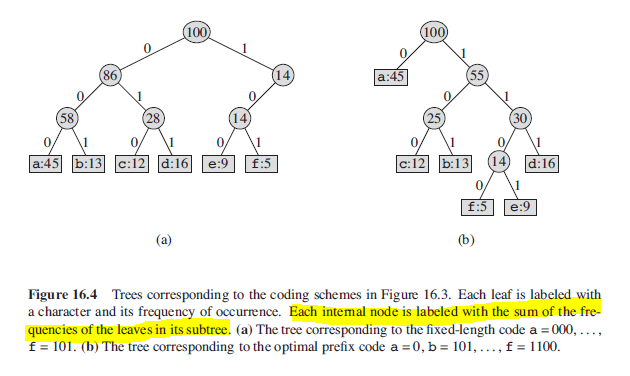
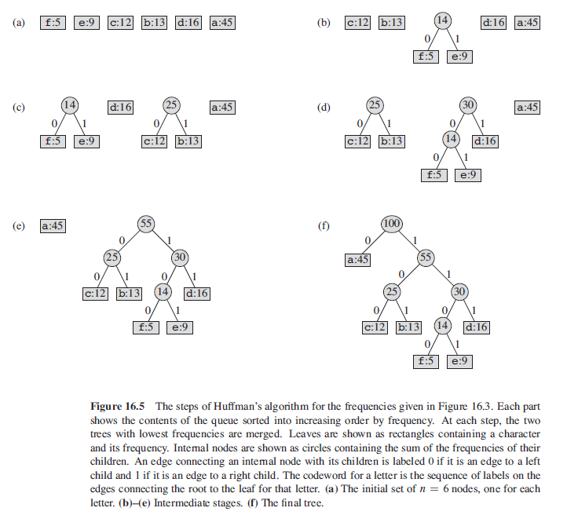

## Huffman Codes

Huffman codes compress data very effectively. Given a sequence of characters as data, Huffman's greedy algorithm uses a table giving how often each character occurs i.e. frequency, to build up an optimal way of representing each character as a binary string.

### Example

Each character is represented by a unique binary string called codeword. If fixed-length is used i.e. 3 bits per character, method requires 300,000 bits to code entire file. If variable-length is used i.e. giving frequent characters shorter codewords, method requires 224,000 bits.

```
variable-length = (45*1 + 13*3 + 12*3 + 16*3 + 9*4 + 5*4) * 1000
                = 224,000 bits
```



## Prefix Codes

Prefix codes are codes in which no codeword is also a prefix of some other codeword. A prefix code can always achieve the optimal data compression among any character code.

Encoding is always simple for any binary character code i.e. simply concantenate the codewords representing each character of the file. For example, abc = 0.101.100 = 0101100.

Prefix codes are desirable because they simplify decoding. Since no codeword is a prefix of any other, the codeword that begins an encoded file is unambiguous.

The decoding process can be represented with a binary tree (not BST) whose leaves are the given characters. An optimal code is always represented by a full binary tree.

## Constructing Huffman Code

```
// each character has "freq" attribute
// algorithm builds tree in bottom-up manner
// Q represents min priority queue i.e. binary min-heap
// tree will have n-1 nodes or merge steps
// codeword for letter is the sequence of edge labels starting from root to letter
// has time complexity of O(nlgn)

char = [a,b,c]
n = char.length
Q = char

for i to n-1
    z = new Node()
    // identifies two least-frequent objects to merge together
    // order of left and right child is arbitrary i.e. switching yields the same cost
    z.left = extractMin(Q)
    z.right = extractMin(Q)
    z.freq = z.left.freq + z.right.freq
    insert(Q,z)

return extractMin(Q)    // return root of the tree

```

### Figure



### Algorithm Steps


