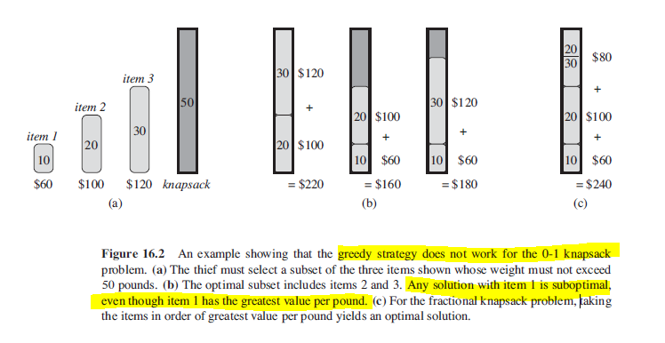

## Knapsack Problem (0-1 and Fractional)

Knapsack problem shows that some problems can only be solved by greedy algorithms, while others require dynamic programming. Problem as follows:

- A thief robbing a store finds n items.
- Each item is worth v dollars and weights w pounds.
- Thief can at most carry W pounds in his knapsack.
- Find the most valuable load.
- 0-1 as thief must either take an item or leave it behind.

The fractional knapsack problem can be solved by a greedy strategy, while 0-1 requires dynamic programming.

For fractional:

- Compute the value per pound for each item.
- Take the item with most value per pound.
- If supply has exhausted, take the next greatest value per pound.

### Example

