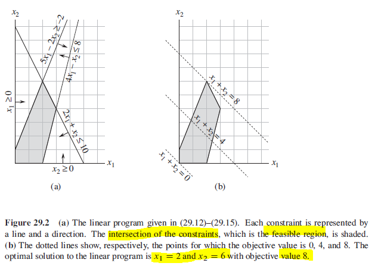

## Linear Programming

Many problems take the form of maximizing/minimizing an objective, given limited resources and competing constraints. The problem can be categorized as linear programming if:

1. We can specify the objective as a linear function of certain variables.
2. We can specify the constraints on resources as equalities/inequalities on those variables.

For problems with known efficient algorithms, it would be better to use them rather than linear programming to solve it i.e. Dijkstra's shortest paths, push-relabel method for maximum flow, etc. Nonetheless, the real power of linear programming comes from the ability to solve new problems.

### General linear programs

In LP, we do not allow strict inequalities.

```
Linear function
f(x1,x2,...xn) = a1x1 + a2x2 + ... + anxn

Linear equality
f(x1,x2,...,xn) <= b
```

### Standard and Slack Forms

To describe the properties of and algorithms for linear programs, it is convenient to express them in canonical forms.

#### Standard

Standard form refers to the maximization of a linear function subject to linear inequalities. Requires non-negativity constraints.

#### Slack

Slack form refers to the maximization of a linear function subject to linear equalities.

## Graphing in Cartesian coordinate system

No accident that an optimal solution to the linear program occurs at a vertex of the feasible region. The max value must be on the boundary of the feasible region.

Intersection can be either a single vertex (single solution) or a line segment (all points on that line are optimal).

```
Maximize
    x1 + x2 (objective function)
Subject to
    4x1 - x2 <= 8
    2x1 + x2 <= 10
    5x1 - 2x2 >= -2
    x1,x2 >= 0
```



## Political Problem Example

Find the minimum amount of advertising cost to spend to win 50% of voters in each area. Urban, suburban and rural have 50,000 votes, 100,000 votes and 25,000 votes respectively.

### Effects of policies on voters (for every $1000 spent)

Negative entries denote votes that would be lost.

| Policy         | Urban | Suburban | Rural |
| -------------- | ----- | -------- | ----- |
| Build roads    | -2    | 5        | 3     |
| Gun Control    | 8     | 2        | -5    |
| Farm Subsidies | 0     | 0        | 10    |
| Gasoline Tax   | 10    | 0        | -2    |

### Trial and error

```
$20,000 on roads
$0 to gun control
$4,000 to farm subsidies
$9,000 to gasoline tax

urban_votes = 20(-2) + 0(8) + 4(0) + 9(10) = 50
suburban_votes = 20(5) + 0(2) + 4(0) + 9(0) = 100
rural_votes = 20(3) + 0(-5) + 4(10) + 9(-2) = 82 (more votes than voters available)
```

### LP

#### Requirements

```
-2w + 8x + 0y + 10z >= 50
5w + 2x + 0y + 0z >= 100
3w - 5x + 10y - 2z >= 25
```

#### Optimization

```
min(w + x + y + z)

w >= 0, x >= 0, y >= 0, z >= 0
```

#### Solution

```
Minimize
    w + x + y + z
Subject to
    -2w + 8x + 0y + 10z >= 50
    5w + 2x + 0y + 0z >= 100
    3w - 5x + 10y - 2z >= 25
    w >= 0, x >= 0, y >= 0, z >= 0
```
