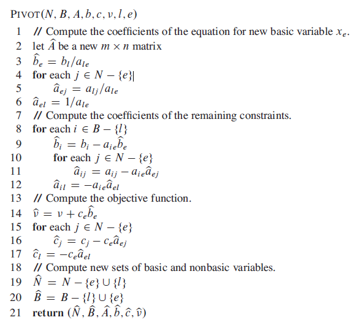
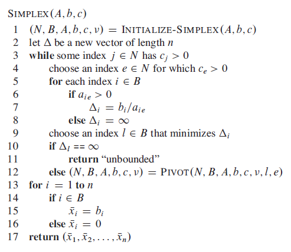

## Simplex Algorithm

Takes as input a linear program and returns an optimal solution. Starts at some vertex of the simplex and performs a sequence of iterations. In each iteration, it moves along an edge of the simplex from a current vertex to a neighbouring vertex whose objective value is no smaller than that of the current vertex. Terminates when it reaches a local maximum.

### Basic, Non-Basic, Pivot

Linear equalities express "basic" variables in terms of other "non-basic" variables. We move from one vertex to another by making a basic variable become non-basic and vice versa. This operation is known as pivot.

## Pivoting

Procedure takes as input a slack form, given by the tuple (N,B,A,b,c,v), the index l of the leaving variable Xl, and the index e of the entering variable Xe.

Lines 3-6 compute the coefficients in the new equation for Xe by rewriting the equation that has Xl on the left-hand side with Xe.

Lines 8-12 updates the remaining equations by substituting the right-hand side of this new equation for each occurrence of Xe.

Lines 14-17 perform the same substitution for the objective function.

Lines 19-20 update the set of nonbasic and basic variables.

### Pseudo

## Simplex

Need to address the following issues:

- How do we determine whether a linear program is feasible?
- What do we do if the linear program is feasible, but the initial basic solution is not feasible?
- How do we determine whether a linear program is unbounded?
- How do we choose the entering and leaving variables?

### Pseudo

INITIALIZE-SIMPLEX() takes as input a linear program in standard form.

Line 1 determines if the linear program is infeasible or returns a slack form.

For lines 3-4, if all the coefficients in objective function are negative, the loop terminates. Otherwise, line 4 selects a variable Xe whose coefficient in the objective function is positive as the entering variable. We assume that we use some prespecified deterministic rule for choosing this.

Lines 5-9 check each constraint and pick the one that most severely limits the amount by which we can increase Xe without violating any of the nonnegativity constraints. For leaving variable, we also assume that we use some prespecified deterministic rule for choosing this. If none of the constraints limits the amount by which the entering variable can increase, the algorithm terminates.

## Termination

No iteration of SIMPLEX() can decrease the objective value assoicated with the basic solution. However, it is possible that an iteration leaves the objective value unchanged. This phenomenon is called **degeneracy** which can prevent the algorithm from terminating as it can lead to **cycling**: SIMPLEX() could choose a sequence of pivot operations that leave the objective value unchanged but repeat a slack form within the sequence. If it is deterministic, it will cycle through the same series of slack forms forever, never terminating.

Cycling is the only reason that SIMPLEX() might not terminate. We can prevent it by choosing the entering and leaving variables more carefully. One option is to always choose the variable with the smallest index, a strategy known as **Bland's rule**.
