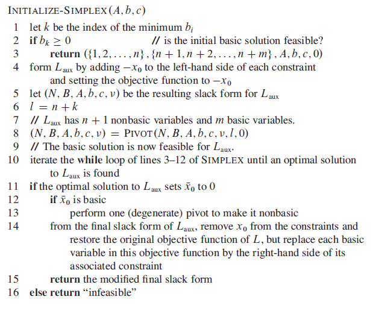

## Initial Basic Solution

A lienar program can be feasible, but the initial basic solution might not be feasible. In order to determine whether a linear program has any feasible solutions, we can formulate the **auxiliary linear program**.

From the auxiliary linear program, we can find a slack form for which the basic solution is feasible. Also, the solution determines whether the initial linear program is feasible and provides one with which we can initialize SIMPLEX().

```
Maximize
    2x1 - x2
Subject to
    2x1 - x2 <= 2
    x1 - 5x2 <= -4      // initializing to 0 violates constraint
    x1,x2 >= 0
```

### Step 1

```
Maximize
    -x0
Subject to
    2x1 - x2 - x0 <= 2
    x1 - 5x2 - x0 <= -4
    x1,x2,x0 >= 0
```

### Step 2 (slack form)

```
z =                -x0
x3 = 2 - 2x1 + x2 + x0
x4 = -4 - x1 + 5x2 + x0
```

### Step 3

Choose x0 to be the entering variable, and x4 to be the leaving variable as it is the basic variable whose value in the basic solution is most negative. Perform one call to PIVOT().

```
z = -4 - x1 + 5x2 - x4
x0 = 4 + x1 - 5x2 + x4
x3 = 6 - x1 - 4x2 + x4

Basic solution is (4,0,0,6,0) which is feasible
```

### Step 4

Call PIVOT() repeatedly until we obtain an optimal solution to auxiliary. In this case, one call to PIVOT() with x2 entering and x0 leaving.

```
// slack form is final solution to auxiliary problem
// x0 is not a basic variable and hence, it is set to 0
z = - x0
x2 = 4/5 - (1/5)x0 + (1/5)x1 + (1/5)x4
x3 = 14/5 + (4/5)x0 - (9/5)x1 + (1/5)x4
```

### Step 5

Restore the original objective function with appropriate substitutions made to include only nonbasic variables, and removing x0 since x0 = 0.

```
Objective function
    2x1 - x2 = 2x1 - (4/5 - (1/5)x0 + (1/5)x1 + (1/5)x4)
             = -4/5 + (9/5)x1 - (1/5)x4

Slack form
    z = -4/5 + (9/5)x1 - (1/5)x4
    x2 = 4/5 + (1/5)x1 + (1/5)x4
    x3 = 14/5 - (9/5)x1 + (1/5)x4
```

### Pseudo

Lines 1-3 checks the minimum of B set and returns slack form if it is greater than 0.

If basic solution is not feasible, need to perform a single pivot operation. Line 6 selects l = n + k as the index of the leaving variable for the upcoming pivot operation. Since the basic variables are Xn+1, Xn+2, ..., Xn+m, the leaving variable Xl will the the one with the most negative value.

Line 10 repeatedly calls PIVOT() to fully solve the auxiliary linear program.

Line 11 creates a slack form for L for which the basic solution is feasible. Firstly, lines 12-13 handle the degenerate case in which X0 which may still be basic. In this case, we perform a pivot step to remove X0 from the basis.


