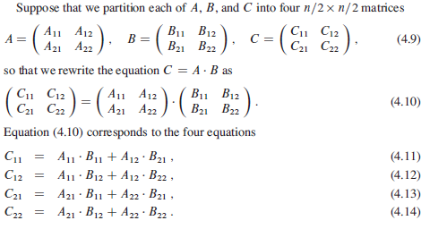

### Strassen Algorithm

For square n x n matrices, has triple nested for loops that runs exactly n iterations and hence, has O(n3) time complexity. Strassen's recursive algorithm runs in O(n^lg7) as it reduces recursive calls to matrix-multiplies from 8 to 7. Requirements:

- Both input matrices should be of dimensions n x n.
- n should be a power of 2.
- If not satisfied, pad the matrices with 0.

https://www.geeksforgeeks.org/easy-way-remember-strassens-matrix-equation/

### Matrix Multiplication



### Procedure

1. Divide the input matrices A and B and output matrix C into n/2 \* n/2 submatrices.
2. Create 10 matrices S1, S2...S10 which is n/2 \* n/2 and is the sum or difference of two matrices created in step 1.
3. Recursively compute seven matrix products P1, P2,... P7, with each as n/2 \* n/2.
4. Compute the desired submatrices by adding/subtracting various combinations of Pi matrices.

```
// step 2
S1 = B12 - B22
S2 = A11 + A12
S3 = A21 + A22
S4 = B21 - B11
S5 = A11 + A22
S6 = B11 + B22
S7 = A12 - A22
S8 = B21 + b22
S9 = A11 - A21
S10 = B11 + B12
```

```
// step 3
P1 = A11 * S1
P2 = S2 * B22
P3 = S3 * B11
P4 = A22 * S4
P5 = S5 * S6
P6 = S7 * S8
P7 = S9 * S10
```

```
// step 4
C11 = P5 + P4 - P2 + P6
C12 = P1 + P2
C21 = P3 + P4
C22 = P5 + P1 - P3 - P7
```
