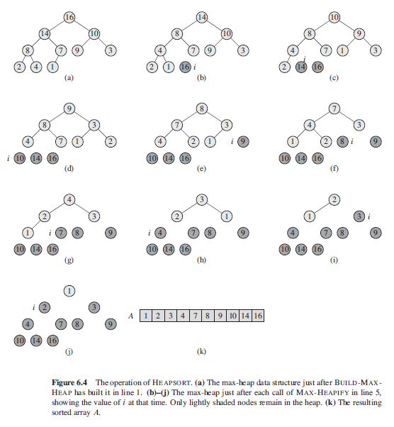
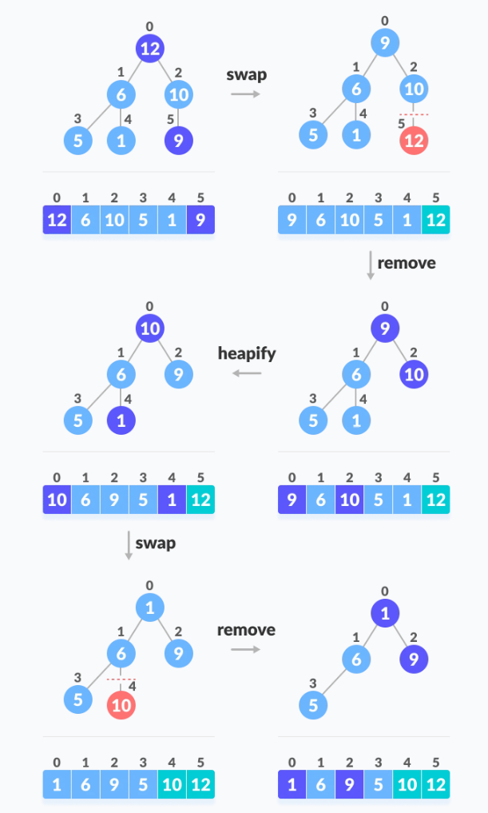

## Heapsort

Heapsort introduces an algorithm design technique using a data structure called "heap". Heap makes it an efficient priority queue. Achieves the best average and worst-case complexities with both of O(nlog2n).

Makes use of binary heap trees as follows:

- Takes an unsorted array and re-arranging it so that it satisfies the heap tree priority ordering.
- Largest item in heap is always in a[1].
- Largest item in sorted array is always in a[n].
- Swaps both items and hence, will have item at right position of the array.
- Discard largest node from heap by decrementing heapSize.
- Perform maxHeapify as new root element might violate the max-heap property.
- Second largest item will be in a[1], and its final position in sorted array is a[n-1].
- Repeat using bubble down procedure down to heapSize of 2.

### Algorithm (Pseudo)

```
heapSort(A) {
    n = A.length
    buildMaxHeap(A)
    for( i = n ; i > 1 ; i-- ) {
        swap A[1] and A[i]
        A.heapSize = A.heapSize - 1
        maxHeapify(A, 1)
    }
}
```

### Sequence of Events





### Sample Code

```js
const maxHeapify = (nums, n, i) => {
  // n is size of heap
  let left = 2 * i + 1;
  let right = 2 * i + 2;
  let largest = i;

  if (left < n && nums[left] > nums[largest]) largest = left;

  if (right < n && nums[right] > nums[largest]) largest = right;

  if (largest !== i) {
    // one of two children is largest
    // largest element gets bubbled up to A[i]
    // swap i with largest
    let temp = nums[i];
    nums[i] = nums[largest];
    nums[largest] = temp;

    maxHeapify(nums, n, largest);
  }
};

const heapSort = (nums) => {
  const n = nums.length;
  let temp;

  // build max heap
  for (let i = Math.floor((n - 1) / 2); i >= 0; i--) {
    maxHeapify(nums, n, i);
  }

  // extract element from heap one by one
  for (let i = n - 1; i > 0; i--) {
    // swap largest at first element with last element
    temp = nums[0];
    nums[0] = nums[i];
    nums[i] = temp;

    // heapify to sort largest element to nums[0]
    maxHeapify(nums, i, 0);
  }
};
```
