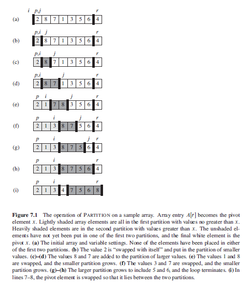

## Quicksort

Applies DAC paradigm as follows:

- Divide: Split/partition given array such that all items in first sub-array are smaller than all items in second sub-array.
- Conquer: Sort the two subarrays by recursive calls to quicksort.
- Combine: As subarrays are already sorted, no work is needed to combine them; concatenate both sub-arrays to give sorted full array.

At each stage, need to choose an item in array as pivot item which is kept in between and separate from both sub-arrays. During each stage, need to tell algorithm which part of array is under consideration. Average time complexity of O(nlog2n) and worst-case of O(n^2). Nonetheless, it generally outperforms heapsort in practice and is a popular algorithm for sorting large input arrays.

### Algorithm (Pseudo)

```
quicksort(A, left, right) {
    if ( left < right ) {
        pivotIndex = partition(A, left, right)
        // element in pivotIndex is in correct position
        // sort elements on its left and right
        quicksort(A, left, pivotIndex-1)
        quicksort(A, pivotIndex+1, right)
    }
}
```

### Choosing Pivot

There is no quick guaranteed way of finding the optimal pivot. If keys are integers, finding the average value would require visiting all entries and adding considerable overhead to algorithm. Hence, some sensible heuristic pivot strategies are:

- Pick FIRST or LAST element as pivot.
- Use random number generator to produce an index k and then use a[k].
- Take a key from the middle of the array i.e. a[(n-1)/2].
- Take a small sample ( e.g., 3 to 5 items) and take the middle key of those.

### Partitioning

Key to the algorithm is the partition procedure, which rearranges the subarray in place.

```
// function places pivot element at its correct position
// places all smaller elements to LEFT and larger elements to RIGHT of pivot

partition(A, left, right) {
    // pivot element selected as A[right]
    pivot = A[right]

    // swap pivot with last value
    swap A[pivotIndex] and A[right]

    leftMarker = left - 1
    rightMarker = right - 1     // rightMarker excludes rightmost pivot element

    // if curElement is < pivot, move it to position of leftMarker
    // else do nothing
    for (i=leftMarker; i <= rightMarker; i++)
        if (A[i] <= pivot)
            leftMarker++
            exchange A[leftMarker] with A[i]

     // put pivot element at the correct position
     exchange A[leftMarker + 1] with A[rightMarker]

     return leftMarker
}
```

```
// randomized paritition
randomizedPartition(A, left, right) {
    i = random(left, right)
    exchange A[right] with A[i]
    return partition(A, left, right)
}
```

### Sequence of Events


